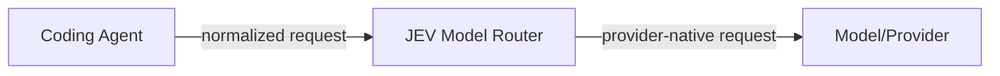
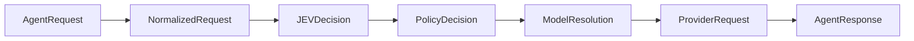
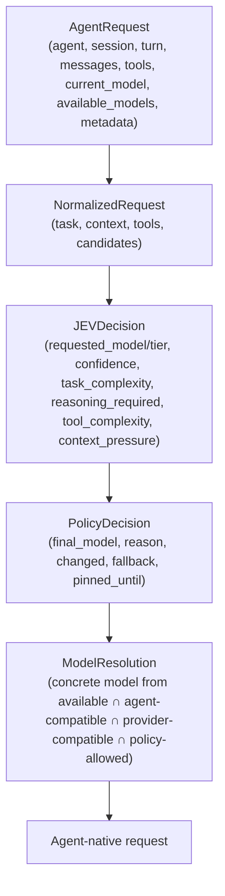
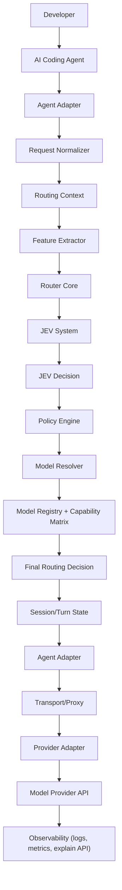
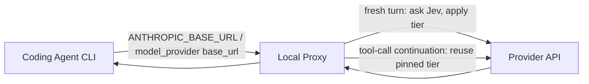

# JEV Model Router — Complete Architecture

> **Status:** Target architecture / implementation blueprint
> **Project:** `jev_model_router`
> **Primary goal:** Build an agent-agnostic model router that can sit in front of coding agents (Claude Code, OpenAI Codex, OpenCode, DeepAgents, Hermes Agent, and future/custom agents).
> **Source:** This file is the single source of truth for design. `docs/` holds only an index
> (`docs/README.md`) and the integration quickstart (`docs/quickstart.md`) — see §13 below.

---

## 1. Executive Summary

```
Coding Agent != Router != Model Provider
```

The coding agent owns the developer experience, tool execution, permissions, sessions, filesystem access, MCP tools, and agent loop.

JEV Model Router owns the **routing decision**:



The router's 8 responsibilities:
1. Capture · 2. Normalize · 3. Analyze context · 4. Ask JEV · 5. Apply routing policy · 6. Resolve concrete model · 7. Pin model for turn · 8. Rewrite/forward

The architecture deliberately separates: agent adapters, routing core, model registry, policy engine, transport/proxy layer, state manager, observability.

Adding a new coding agent should require an **adapter**, not a rewrite of the routing engine.

---

## 2. Design Goals

- **Agent agnostic:** Core router works with any adapter. Adding an agent = new adapter + fixtures + tests. No `if agent == "claude":` in core.
- **Per-turn intelligent routing:** One routing decision per fresh user turn, pinned through the entire tool loop.
- **Provider agnostic:** Supports Anthropic, OpenAI, Google, Groq, OpenRouter, Azure OpenAI, Bedrock, Ollama, LM Studio, custom endpoints.
- **Fail open:** Missing key, timeout, 5xx, or malformed JEV response → fall back to current/default model and record why.
- **Explicit human override:** User model choice always wins over automatic routing.
- **Explainability:** Every routing decision is explainable locally (task complexity, confidence, policy, reason).
- **Privacy-safe:** Never log prompts, keys, or auth headers by default. Send minimum data to JEV.
- **Native agent experience:** Preserve tool execution, permissions, sessions, MCP, streaming, agent-specific commands.

---

## 3. Non-Goals

JEV does NOT own: filesystem manipulation, code execution, terminal commands, patch generation, repository permissions, MCP server implementation, interactive coding UX, agent memory, task planning.

---

## 4. Core Architectural Principle

The pipeline contract creates a hard boundary between integration code and routing logic:



Type model:



---

## 5. High-Level System Architecture



Dependency direction is one-way: **CLI → adapters → core → contracts**. Providers and transports are injected, never imported by policy code.

---

## 6. Major Components

| Component | Responsibility |
|---|---|
| CLI/Launcher | Start router, detect agents, select adapter, load config |
| Agent Adapter Layer | Normalize requests, apply model, detect turns |
| Routing Core | Route: validate → check overrides → ask JEV → policy → resolve → pin |
| Policy Engine | Explicit override, safety constraints, confidence thresholds, cost/latency/cache |
| Model Resolver | Pick concrete model from available ∩ agent-compatible ∩ provider-compatible ∩ policy-allowed |
| State Manager | Turn pinning, sub-agent isolation, session store, lifecycle |
| Transport/Proxy | Forward requests, streaming, local proxy |
| Observability | Structured events, privacy-safe logging, explain API, metrics |
| Security/Privacy | Auth, redaction, local proxy binding, request mutation rules |
| Config/Loader | CLI args > env vars > project config > user config > defaults |

---

## 7. Routing Invariants (must not regress)

- **JEV is the only routing authority.** `TYPESAFE_API_KEY` is read exclusively by `jev/client.py`. `core/classifier.py` must not grow into an independent LLM router.
- **One routing decision per fresh user turn.** Pin selected model for the whole tool loop; tool results, continuations, and telemetry bypass routing.
- **Explicit user model choice always wins** over automatic routing.
- **Fail open, but never silently:** missing key, timeout, 5xx, malformed JEV → fall back to current/default model and record why.
- **State is scoped `agent + session + turn`.** Sub-agent decisions must not overwrite parent session's pinned model. No global `current_model`.
- **Policy sits between JEV and execution:** JEV output → policy (confidence thresholds, override, availability, context protection) → resolver → concrete model.
- **Never log prompts, keys, auth headers, or raw responses** by default.

---

## 8. Architectural Rules

1. **Core never imports an agent adapter** — `core → contracts`, not `core → claude`
2. **Adapter never owns routing policy** — adapters parse and rewrite, they don't decide which model is "better"
3. **JEV never becomes the runtime state manager** — JEV recommends, doesn't own sessions/turns/overrides
4. **One routing decision per fresh turn** — don't re-route every tool call
5. **Explicit user choice wins** — automation optimizes, doesn't override
6. **Fail open** — routing failure must not stop coding
7. **No protocol leakage** — agent-specific formats stay in adapters
8. **Capability first, vendor second** — think "strong reasoning", not "use Claude Opus"
9. **Preserve native behavior** — router should be invisible during normal coding
10. **Minimize sensitive data** — only send what's needed for routing

---

## 9. Project Structure

```
src/jev_router/
├── cli/  · core/  · contracts/  · adapters/  · providers/
├── jev/  · transport/  · state/  · config/  · observability/  · security/
```

Dependency direction: `CLI → Adapters → Core → Contracts`.

Interface contracts: `Router.route()`, `Policy.evaluate()`, `ModelResolver.resolve()`, `AgentAdapter.*`.

---

## 10. Configuration

Precedence: **CLI args > env vars > project config > user config > defaults**.

Default config: `jev.timeout_ms: 1500`, `deadline_ms: 3000`, `max_retries: 1`.

Routing is disabled (passthrough) when `TYPESAFE_API_KEY` is absent.

SDK transport is opt-in (`jev.client: sdk` / `JEV_CLIENT=sdk`, `pip install jev-router[typesafe]`); default stdlib preserves zero-deps.

---

## 11. Testing Rules

- pytest only, `pyproject.toml` sets `testpaths = ["tests"]`.
- Mock the JEV API in all default tests. Live tests are opt-in: `JEV_LIVE_TESTS=1`.
- Adapter tests are fixture-driven (`tests/fixtures/`).
- Every non-trivial change to policy, resolution, overrides, fresh-turn detection, state isolation, or fallback needs a test.

---

## 12. Implementation Phases

Phase 0 — Contracts · Phase 1 — JEV Core · Phase 2 — Model Registry · Phase 3 — State · Phase 4 — Claude Code Adapter · Phase 5 — Codex · Phase 6 — OpenCode · Phase 7 — Hermes · Phase 8 — DeepAgents · Phase 9 — Observability.

All phases are implemented; see `AGENTS.md`'s "Current state of this repo" for what's real.
Per-turn routing via a live local proxy is implemented as a separate package, `jev_router_live`
— see §16.

---

## 13. Documentation Structure

`docs/` holds exactly two files:

```
docs/
├── README.md        # Points to this file and to quickstart.md
└── quickstart.md # Integration guide: install, set TYPESAFE_API_KEY, CLI usage
```

This file (`ARCHITECTURE.md`) is the single source of truth for design — read it directly
rather than a mirrored split. `docs/` previously contained a one-file-per-section split (14
files) plus five empty placeholder directories; both were removed as unnecessary duplication
that had to be kept in sync by hand. `docs/quickstart.md` may be hand-edited directly to
stay accurate to `src/`; propose design changes against this file.

---

## 14. Success Criterion

The strongest test: **Can a new coding agent be added without modifying `core/router.py`, `core/policy.py`, or `core/resolver.py`?**

The target answer is: **YES.** Adding a new agent should require only a new `adapters/<name>/` directory + fixtures + tests + registration in the adapter registry.

---

## 15. Reference Material

- OpenCode: provider configuration and custom `baseURL` support — https://opencode.ai/docs/providers
- Hermes Agent: provider/model selection, custom providers, runtime provider resolution — https://github.com/NousResearch/hermes-agent

---

## 16. Live Per-Turn Routing (`jev_router_live`)

`jev_router` routes once, at session start (§1–§15). `jev_router_live` is a second, independent
package under `src/jev_router_live/` that routes **every fresh user turn**, by running a local
HTTP proxy in front of the coding agent's own API instead of launching the agent with a
pre-resolved model. The two packages share nothing at runtime — no imports either direction —
because they solve different problems: `jev_router` targets any adapter-compatible agent;
`jev_router_live` targets exactly the two CLIs (Claude Code, OpenAI Codex) whose HTTP wire
protocol it knows how to rewrite in place.

### 16.1 Why a proxy instead of a pre-resolved model

Session-start routing (§1) can only look at the first prompt. A session that starts with a
trivial question and later asks for a hard refactor is stuck on whichever model matched turn
one. Per-turn routing fixes this by staying in the request path for the whole session: a local
HTTP server sits between the agent CLI and the model provider's API, and every request that
opens a fresh user turn gets a new routing decision before it leaves the machine.



### 16.2 Sentinel model, not a config flag

The agent CLI is told (via environment variables, `bin/jev_claude.py` / `bin/jev_codex.py`)
that a model named `jev-router` (`AUTO_MODEL` / `CODEX_AUTO_MODEL`) exists and is selected by
default. Because neither CLI validates model names against a custom base URL, the sentinel
travels untouched in the request body. Its presence in a request is therefore an exact,
unambiguous signal: "route this turn." Any other model name means the user picked one
themselves with the CLI's own `/model` picker, and the proxy passes that request straight
through unmodified — automatic routing never overrides an explicit human choice (Rule 5, §8).

### 16.3 Fresh-turn detection

A turn can span many HTTP requests while the agent works through tool calls; only the first of
those requests reflects a real decision point. `proxy.py`'s `new_turn_prompt` (Claude Code) and
`codex_proxy.py`'s `codex_new_turn_prompt` (Codex) both apply the same test: a request counts as
a fresh turn only if its last message has `role: user`, is not a tool-result/tool-output
continuation, and carries at least one tool definition (ruling out the CLI's own auxiliary
calls, e.g. title generation). Injected `<system-reminder>` / `<environment_context>` /
`<current_datetime>` blocks are stripped before the prompt reaches Jev, since they are noise to
the router and measurably blunt its confidence.

Two request shapes observed from Claude Code 2.1.282 are handled explicitly:

- **Resent turns.** Claude Code sends a turn's first request twice (first with a short set of
  `<system-reminder>` blocks and a trailing `role: system` message, then with the full set).
  A fresh-turn request whose prompt *and* conversation length (user/assistant messages) equal
  the last routed turn is treated as the same turn: the pinned model is reused and Jev is not
  asked again. The same rule absorbs client retries after an API error. A genuinely repeated
  prompt on a later turn has a longer conversation and is routed normally.
- **Prompt suggestions and local commands.** After each turn, interactive Claude Code asks, in
  the same conversation, for a suggested next prompt (`[SUGGESTION MODE: …`); that is not a
  user turn and never calls Jev or changes the pinned model. Transcripts of local slash
  commands (`<command-name>/model</command-name>`, `<local-command-stdout>…`) are stripped from
  the prompt sent to Jev.
- **Auxiliary calls on the sentinel.** Some internal calls (e.g. a status summary with no
  tools) carry `jev-router` without belonging to a routed conversation. They run on the model
  their session was most recently routed to — what the user would be on had they picked it —
  else on the fallback tier's catalog model. They never call Jev.

### 16.4 Conversation-scoped pinning

Each conversation gets a stable key (`conversation_key` / `codex_conversation_key`) derived from
the session id plus the user-authored text of the first message (injected `<system-reminder>`
blocks stripped, since their set varies between requests of the same conversation) — never from
mutable fields the CLI rewrites between requests (cache-control breakpoints, metadata). The tier chosen for a fresh turn is
pinned against that key and reused by every follow-up request in the same turn, including
sub-agent calls running through the same endpoint, which get their own key and can never leak a
model choice into the parent conversation. This mirrors §7's "state is scoped `agent + session +
turn`" invariant, at proxy granularity instead of adapter granularity.

### 16.5 Policy layer (shared, pure)

`policy.py`'s `decide()` is a pure function reused by both proxies: given a Jev answer, the tier
currently pinned, and the tiers actually available to the account, it returns the tier to run
and why. It layers, in order: an explicit override phrase in the prompt ("use haiku", "switch to
strong") beats everything; a missing/malformed Jev response falls back to the current tier
(fail open, §7); low-confidence answers refuse to downgrade and cap how far they can upgrade;
and a downgrade is skipped outright once the conversation is large enough that rebuilding the
prompt cache would cost more than the downgrade saves. That cache guard applies only once a
model is pinned: a conversation's first decision (`first_turn=True`) has no cache to protect,
so a system-prompt-heavy first request (~20k+ tokens) can still be routed down to Haiku. Every
branch is reviewable in one place and unit-tested independently of any HTTP or proxy code
(`tests/live/test_live_policy.py`).

Jev recommends; `decide()` decides. The proxy maps Jev's exact model id back to a tier, runs
the policy, and only then resolves the final tier to a concrete catalog id (Jev's exact id when
policy accepted its tier). A Jev answer naming a model that was not offered is treated as no
answer.

### 16.6 Request rewriting

Once a tier is chosen, `apply_tier` / `apply_codex_tier` rewrite the outgoing request body in
place: point `model` at that tier's concrete id, and strip request fields the target tier cannot
accept (e.g. `thinking`/`effort` when downgrading to a tier that doesn't support them) so the
rewritten request is never rejected by the provider for a shape mismatch the agent CLI didn't
know to avoid.

### 16.7 Observability

Three outputs, from least to most sensitive:

- **Decision log** (`~/.jev-claude.log`, always on, file only — never stderr, so it cannot
  corrupt Claude Code's TUI or `-p` output): one line of safe metadata per routed turn, e.g.
  `turn=a6ba87d7ab94 decision=opus model=claude-opus-5-5 confidence=0.97 latency=412ms
  reason=jev ctx~3406`, plus the model catalog and any routing/upstream failure. Never prompts,
  keys, headers or bodies.
- **Status file** (`status.py`): per session, the full decision including the prompt and Jev's
  exact request/response, so `jev-explain` / the status line can show it. Kept in
  `<tempdir>/jev-claude/`, which is only used if it is a real directory owned by the current
  user and mode 0700 (on shared `/tmp`, a directory pre-created by another user is refused);
  files are created 0600 atomically and pruned after 7 days idle.
- **Debug tracing** (`JEV_DEBUG=1`, opt-in): adds per-request rewrite lines and the first 60
  characters of each routed prompt.

### 16.8 Fail-open

Exactly as in §7: routing never blocks or breaks a turn, and the sentinel never reaches the
provider.

| Failure | Behavior |
|---|---|
| `JEV_API_KEY` unset | `jev-claude` starts plain Claude Code, no proxy, no picker row |
| Jev timeout / network error / 5xx | 1.5 s per attempt, one retry, 3 s hard wall-clock deadline, then keep the current tier (first turn: Opus) |
| Jev 4xx (bad key, bad request) | no retry (it cannot succeed); keep the current tier |
| Malformed answer, or a model that was not offered | treated as no answer |
| Unexpected exception while routing | request is sent on the fallback catalog model, error logged |
| Upstream unreachable | 502 with an Anthropic-shaped error body, logged |

Each failure is logged; none is silent.

### 16.9 Model catalog

The models offered to Jev come from the account's own `/v1/models` catalog: the newest model
in each tier, listed cheapest tier first (older versions of a tier are left out — they add
noise and tokens to every Jev call). Claude Code's own gateway discovery never calls
`/v1/models` for claude.ai-subscription logins (it requires an API key, `ANTHROPIC_AUTH_TOKEN`
or `apiKeyHelper`), so the proxy reads the catalog itself on the first routed turn, reusing
that request's credential and `anthropic-*` headers: one attempt per process, 2 s timeout. If
it fails, routing uses the static ids in `config.py` `TIERS`, which are verified against Claude
Code's shipped model catalog — no model id is ever invented. Fable is offered only with
`JEV_ALLOW_FABLE=1` (it bills extra usage credits).

### 16.10 Streaming and connections

Every response except `/v1/models` is relayed as it arrives (`read1` loop, flushed per chunk),
so SSE token streams reach Claude Code immediately; routing happens before the upstream request
is sent, never during the stream. Status, headers and body pass through unchanged except
framing: chunked stays chunked (re-framed for our side), fixed-length keeps its exact length,
close-delimited closes. Forwarding upstream's `Transfer-Encoding: chunked` next to a
`Content-Length` was the cause of the Windows `WinError 10054` resets (Node rejects the invalid
response and resets the socket).

Connection failures are split by side. A **client** reset (Claude Code dropping an idle
keep-alive socket or exiting mid-stream; `WinError 10054/10053`, `BrokenPipeError`) is normal
and only visible under `JEV_DEBUG`. An **upstream** failure (connect error, reset mid-stream)
is a real problem: it is logged, and a stream cut mid-way is closed without a clean end so the
client sees a truncated response rather than a fake success. Any other handler exception is
logged with its traceback to the log file, never printed over the TUI.

### 16.11 Authentication and verification

The live proxy reads exactly one credential, `JEV_API_KEY` (from the environment, or
`./.env`, `~/.jev-router.env`, `~/.jev-claude.env`); `TYPESAFE_API_KEY` is ignored by
`jev_router_live` (a test enforces that no live module references it). `jev_router`'s
session-start CLI (§1–§15) still uses `TYPESAFE_API_KEY`. Anthropic credentials are Claude
Code's own and pass through untouched.

Verification layers: unit/integration tests with a mocked Jev (`tests/live/`), an opt-in test
against the real Jev API (`tests/live/test_live_jev_api.py`, `JEV_LIVE_TESTS=1` + a real key),
and real Claude Code runs via `jev-claude` (optionally against `scripts/fake_jev.py`, a local
System One stand-in, when the real API is not reachable).
