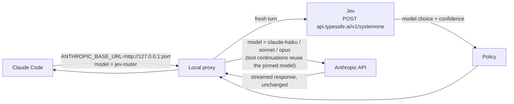

# JEV Model Router — Architecture

> **Package:** `src/jev_router_live/` · **Commands:** `jev-claude`, `jev-codex`, `jev-explain`
> **Source of truth** for the design. `docs/quickstart.md` is the user guide; `AGENTS.md` holds
> the rules for changing the code.

---

## 1. Purpose and Scope

JEV Model Router picks the model for **each new user turn** of a Claude Code (or OpenAI Codex)
session, using TypeSafe's Jev to judge the turn, while the coding agent keeps working exactly
as it normally does.

Jev is a [System One model](https://docs.typesafe.ai/introduction/coding-agents): it does not
write code or replace the LLM behind the coding agent. It answers a few fast, typed questions
about a state and returns structured answers with calibrated confidence. The router uses it for
one decision per turn — *which of these models should handle this request?* — which is the
"route a request to one of a fixed set of destinations, and know how confident that routing is"
use TypeSafe's docs describe. Claude remains the model that does the work.

Owned by the router: the routing decision, the local proxy, rewriting the request's model.
Owned by the coding agent, untouched: tools, permissions, sessions (`/resume`), authentication,
streaming, the TUI.

---

## 2. Request Flow



Per request with `model == "jev-router"`:

1. **Fresh turn?** (§5) If not — a tool continuation, a resent request, an auxiliary call —
   reuse the conversation's pinned model and skip to step 5.
2. **Ask Jev** (§7) with the prompt, the current model, the context size and the account's
   models (§9).
3. **Policy** (§6) turns Jev's recommendation into the final tier.
4. **Pin** the resulting model to the conversation (§5.2).
5. **Rewrite** only `model` and fields that model cannot accept (§8), forward, stream back (§11).

Any other model name is the user's explicit choice and is forwarded unmodified.

---

## 3. Module Layout

```
src/jev_router_live/
├── config.py         # tiers, thresholds, override phrases, Jev questions — every knob in one file
├── policy.py         # decide(): pure, total routing policy
├── router.py         # ask_jev(): dispatch to the stdlib client, or the SDK with JEV_CLIENT=sdk
├── stdlib_router.py  # the Jev System One client (stdlib urllib, zero dependencies)
├── sdk_router.py     # optional client via typesafe-sdk
├── proxy.py          # Claude Code proxy: turn detection, pinning, catalog, rewrite, streaming
├── codex_proxy.py    # OpenAI Codex proxy (Responses API), same policy
├── status.py         # per-session decision file (private dir)
├── explain.py        # jev-explain report
├── settings.py       # restore Claude Code's saved default model on exit
├── log.py            # decision log / debug tracing
├── env_file.py       # .env loading for TYPESAFE_API_KEY
├── bin/              # jev_claude, jev_codex, jev_statusline, jev_explain
└── skills/           # Codex $jev-explain skill (package data)
```

Boundaries: the Jev client knows nothing about Claude Code; `policy.py` knows nothing about
HTTP; the proxy is the only module that understands the Anthropic wire format.

---

## 4. Sentinel Model and the `/model` Picker

`jev-claude` starts Claude Code with (`bin/jev_claude.py`):

| Variable | Value | Why |
|---|---|---|
| `ANTHROPIC_BASE_URL` | `http://127.0.0.1:<port>` | send API traffic through the proxy |
| `ANTHROPIC_CUSTOM_MODEL_OPTION` | `jev-router` | adds the sentinel as a `/model` row |
| `ANTHROPIC_CUSTOM_MODEL_OPTION_NAME` | `JEV Router` | the row's label |
| `ANTHROPIC_MODEL` | `jev-router` (unless the user set one) | start the session on it; never saved as the default |
| `…_SUPPORTED_CAPABILITIES` | thinking, effort | Claude Code keeps composing them; the proxy strips what the routed model can't take |

Claude Code 2.1.282 appends the custom option to `/model` unconditionally (confirmed in its
source and in a real session). Because it does not validate model names behind a custom base
URL, the sentinel travels verbatim in the request body, so its presence is an exact signal:
*route this turn*. Any other model means the user picked one in `/model` — routing is off and
the request passes through untouched; picking "JEV Router" again turns it back on. The sentinel
never reaches Anthropic. On exit, `settings.py` restores the user's saved default model if
Claude Code had persisted the sentinel.

---

## 5. Turns and Conversations

### 5.1 Fresh-turn detection

A turn spans many HTTP requests while Claude works through tool calls; only its first request
is a decision point. `new_turn_prompt()` treats a request as a fresh turn only if it carries tool
definitions and its last non-system message is a `user` message that is not a `tool_result`.
Before the prompt goes to Jev, injected `<system-reminder>` blocks and local slash-command
transcripts (`<command-name>/model</command-name>`, `<local-command-stdout>…`) are stripped —
they are noise to the router and blunt Jev's confidence.

Request shapes observed from Claude Code 2.1.282 and handled explicitly:

- **Resent turns.** A turn's first request is sent twice (first with fewer injected reminders
  plus a trailing `role: system` message). The same prompt at the same conversation length
  (user/assistant messages) is the same turn: the pinned model is reused and Jev is not asked
  again. This also absorbs client retries. A repeated prompt on a *later* turn has a longer
  conversation and is routed normally.
- **Prompt suggestions.** After each turn, interactive Claude Code asks in the same conversation
  for a suggested next prompt (`[SUGGESTION MODE: …`). Not a user turn: no Jev call, pinned model
  unchanged.
- **Auxiliary calls on the sentinel** (e.g. a status summary with no tools) run on the model
  their session was last routed to, else the fallback tier's catalog model. They never call Jev.

### 5.2 Conversation-scoped pinning

Each conversation is keyed by the session id plus the user-authored text of its first message
(reminders stripped) — never mutable fields such as cache-control breakpoints. The model chosen
for a turn is pinned to that key for every request of the turn. Sub-agents running through the
same endpoint have a different first message, so they get their own key and cannot leak a model
choice into the main conversation.

---

## 6. Policy: Jev Recommends, the Router Decides

`policy.decide()` is pure and total: given Jev's answer (mapped from exact model id to tier),
the pinned tier and the tiers the account can run, it returns the final tier and a reason.

1. **Prompt override** — "use opus", "switch to fast", … beats everything (`override`).
2. **No usable answer** (failure, malformed, a model that was not offered) — keep the current
   tier (`jev-unavailable`).
3. **Low confidence** (below `THRESHOLDS.min_confidence`, 0.3) — never downgrade; cap upgrades
   at Sonnet (`low-confidence-*`).
4. **Cache protection** — once a model is pinned, a downgrade in a conversation larger than
   20k tokens is skipped: switching models rebuilds the prompt cache, which costs more than the
   downgrade saves (`downgrade-not-worth-cache-rebuild`). A conversation's **first** decision has
   no cache to protect, so a system-prompt-heavy first request can still go to Haiku.
5. Otherwise follow Jev (`jev`), clamped to the nearest available tier, preferring up over
   down and never stepping up into Fable unless asked.

The proxy then resolves the tier to a concrete model id — Jev's exact id when policy accepted
its tier. Every threshold lives in `config.py`. TypeSafe's confidence-routing guidance suggests
per-consequence thresholds (e.g. a 0.6 floor for acting automatically); the router's 0.3 floor
only gates *downgrades and large upgrades*, and should be tuned against real Jev data.

---

## 7. The Jev Call

One `POST https://api.typesafe.ai/v1/systemone` per fresh turn, `Authorization: Bearer
$TYPESAFE_API_KEY`, matching TypeSafe's documented request/response shapes:

```json
{
  "model": "jev-latest",
  "state": {
    "request": "<the user's prompt, cleaned>",
    "session": {"current_model": "claude-opus-5-5", "context_tokens": 3406},
    "environment": {"available_models": ["claude-haiku-4-5-20251001", "claude-sonnet-5", "claude-opus-5-5"]}
  },
  "questions": {
    "task_complexity":    {"type": "score",  "instructions": "…", "criteria": ["None", "Very low", "…", "Extreme"]},
    "reasoning_required": {"type": "score",  "instructions": "…", "criteria": ["…"]},
    "tool_complexity":    {"type": "score",  "instructions": "…", "criteria": ["…"]},
    "model":              {"type": "choice", "instructions": "Pick the cheapest exact model that can fully complete this…",
                           "criteria": {"claude-haiku-4-5-20251001": "…", "claude-sonnet-5": "…", "claude-opus-5-5": "…"}}
  }
}
```

The answer's `model.choice` / `model.confidence` drive routing; the three scores are shown by
`jev-explain`. All questions go in one request (TypeSafe evaluates them in parallel, so extra
questions barely change latency).

Latency budget (interactive hot path): 1.5 s per attempt, at most one retry — only for
timeouts, network errors and 5xx, never 4xx — and a hard 3 s wall-clock deadline enforced
outside the socket timeouts. Measured ~0.3 s warm, ~1 s cold. `JEV_CLIENT=sdk` uses the official
`typesafe-sdk` with the same key and limits.

---

## 8. Request Rewriting

Only what the chosen model requires changes: `model` is set to its concrete id; for a model
without adaptive thinking/effort (Haiku), `thinking`, thinking-related `context_management`
edits and `output_config.effort` are removed, since Claude Code composed the body for the
sentinel's declared capabilities and Anthropic would reject them. Messages, tools, system
prompt, metadata and headers are forwarded unchanged. MCP tool schemas using draft-04 boolean
`exclusiveMinimum/Maximum` are normalized, because Claude Code only does that itself when
talking to Anthropic directly.

---

## 9. Model Catalog

Jev is offered the account's own models: the newest model in each tier from `/v1/models`,
cheapest tier first (older versions of a tier add noise and tokens without being better
choices). Claude Code's own gateway discovery never calls `/v1/models` for claude.ai
subscription logins (it requires an API key, `ANTHROPIC_AUTH_TOKEN` or `apiKeyHelper`), so the
proxy reads it itself on the first sentinel request (Claude Code makes one at startup), reusing
that request's credential and `anthropic-*` headers: one attempt per process, 2 s timeout. If it
fails, the static ids in `config.py` `TIERS` are used — verified against Claude Code's shipped
model catalog; no model id is ever invented. Fable is offered only with `JEV_ALLOW_FABLE=1`
(it bills extra usage credits).

---

## 10. Fail-Open

Routing is an optimization; it never blocks or breaks a turn, and the sentinel never reaches
the provider.

| Failure | Behavior |
|---|---|
| `TYPESAFE_API_KEY` unset | `jev-claude` starts plain Claude Code: no proxy, no picker row |
| Jev timeout / network error / 5xx | one retry within the 3 s deadline, then keep the current tier (first turn: Opus) |
| Jev 4xx (bad key, bad request) | no retry; keep the current tier |
| Malformed answer, or a model that was not offered | treated as no answer |
| Unexpected exception while routing | request sent on the fallback catalog model, error logged |
| Upstream unreachable | 502 with an Anthropic-shaped error body, logged |

Every failure is logged; none is silent.

---

## 11. Streaming and Connections

Every response except `/v1/models` is relayed as it arrives (`read1` loop, flushed per chunk),
so SSE token streams reach Claude Code immediately; routing finishes before the upstream request
is sent. Status, headers and body pass through unchanged except framing: chunked stays chunked
(re-framed for our side), fixed-length keeps its exact length, close-delimited closes.
Forwarding upstream's `Transfer-Encoding: chunked` next to a `Content-Length` was the cause of
the Windows `WinError 10054` resets (Node rejects the invalid response and resets the socket).

Connection failures are split by side. A **client** reset (Claude Code dropping an idle
keep-alive socket or exiting mid-stream; `WinError 10054/10053`, `BrokenPipeError`) is normal
and only visible under `JEV_DEBUG`. An **upstream** failure (connect error, reset mid-stream) is
logged, and a stream cut mid-way is closed without a clean end so the client sees a truncated
response rather than a fake success. Any other handler exception is logged with its traceback
to the log file, never printed over the TUI.

---

## 12. Security and Observability

- **Credentials.** Exactly one Jev credential, `TYPESAFE_API_KEY` — the name TypeSafe's docs
  and official SDK use (environment, `./.env`, `~/.jev-router.env`, `~/.jev-claude.env`). The
  variable name is defined only in `config.py` (a test enforces that no other module reads a
  key). The earlier name `JEV_API_KEY` is not read; if it is set without `TYPESAFE_API_KEY`, the
  launchers print a one-line notice to rename it (never its value). Anthropic credentials are
  Claude Code's own and pass through untouched; the proxy reuses them only to read
  `/v1/models`. The proxy binds to `127.0.0.1`.
- **Decision log** (`~/.jev-claude.log`, always on, file only — never stderr, so it cannot
  corrupt the TUI or `-p` output): one line of safe metadata per routed turn, e.g.
  `turn=a6ba87d7ab94 decision=opus model=claude-opus-5-5 confidence=0.97 latency=412ms reason=jev
  ctx~3406`, plus the model catalog and any failure. Never prompts, keys, headers or bodies.
- **Status file** (`status.py`): the full last decision per session, including the prompt and
  Jev's exact request/response, for `jev-explain` and the status line. Kept in
  `<tempdir>/jev-claude/`, used only if it is a real directory owned by the current user with
  mode 0700 (on shared `/tmp`, a directory pre-created by another user is refused); files are
  created 0600 atomically and pruned after 7 days idle. The status-line `--settings` file is
  created there with a unique name and deleted on exit.
- **Debug tracing** (`JEV_DEBUG=1`, opt-in): per-request rewrite lines and the first 60
  characters of each routed prompt.

---

## 13. OpenAI Codex

`jev-codex` applies the same design to Codex: a temporary `jev` model provider pointing at a
local proxy for the Responses API, a `jev-router` entry injected into Codex's model catalog, the
same Jev client and policy, and a commentary line in the stream announcing each decision. It
has not had the real-session verification Claude Code has had (§14).

---

## 14. Verification

| Layer | What | How |
|---|---|---|
| Unit / integration | policy, Jev client, proxy against a fake Anthropic upstream: turn detection, pinning, catalog, streaming, failures, security | `python -m pytest` (Jev mocked; runs in CI) |
| Real Jev API | trivial / medium / hard prompts produce valid decisions | `JEV_LIVE_TESTS=1 TYPESAFE_API_KEY=… python -m pytest tests/live/test_live_jev_api.py -s` |
| Real Claude Code | `jev-claude` end to end: picker, routed turns, tool-loop pinning, manual override, fail-open | `jev-claude` (optionally with `JEV_ENDPOINT` pointed at `scripts/fake_jev.py`) |

---

## 15. Known Limitations

- Routing is per turn, not per tool call: a turn that turns out harder than its prompt looked
  stays on its model until the next user turn.
- The first request of a process can take up to ~5 s longer in the worst case (2 s catalog read
  + 3 s Jev deadline); a normal turn costs one Jev call.
- The picker row and request shapes depend on Claude Code behavior verified on 2.1.281–2.1.282
  (`ANTHROPIC_CUSTOM_MODEL_OPTION*`, the resent first request, suggestion mode).
