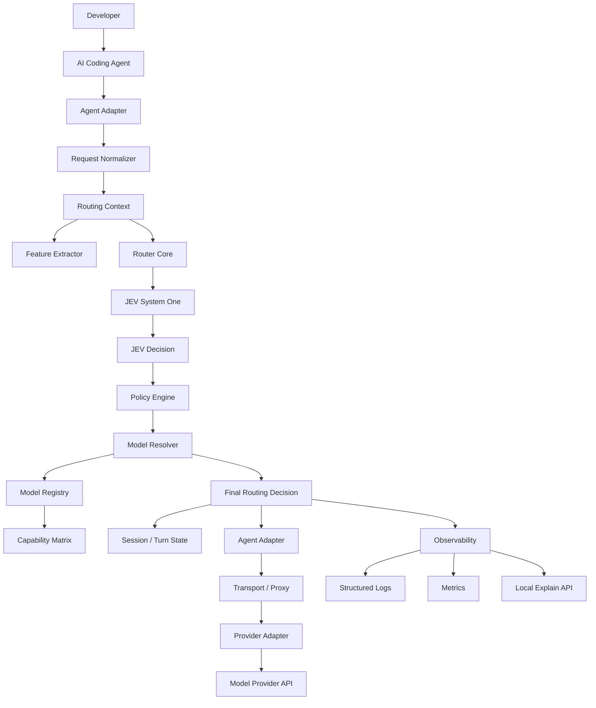
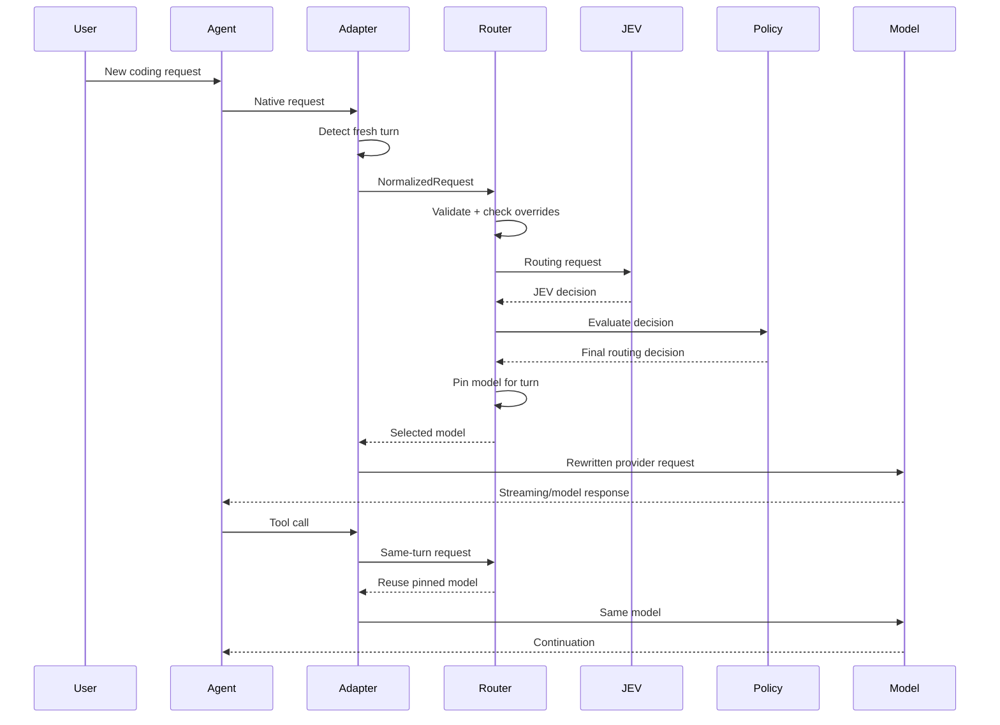
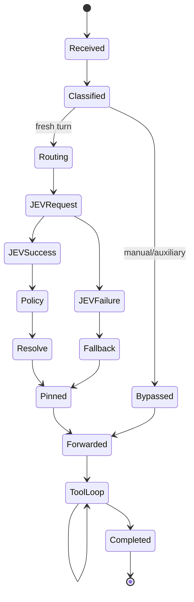
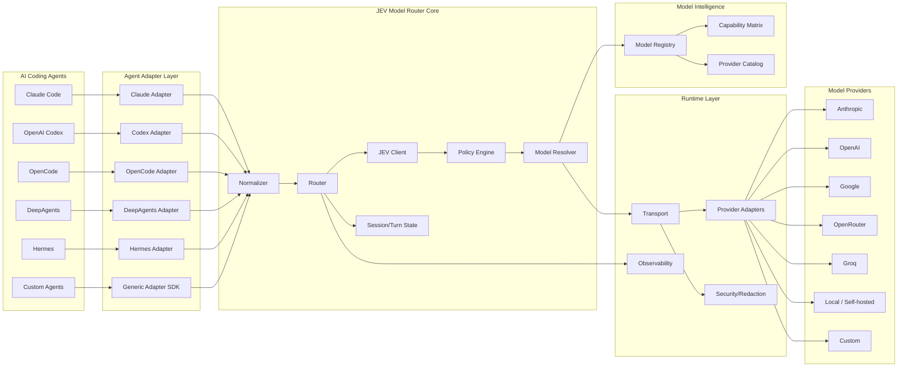

# JEV Model Router — Complete Architecture

> **Status:** Target architecture / implementation blueprint  
> **Project:** `jev_model_router`  
> **Primary goal:** Build an agent-agnostic model router that can sit in front of coding agents such as Claude Code, OpenAI Codex, OpenCode, DeepAgents-based coding agents, Hermes Agent, and future/custom agents.

---

## 1. Executive Summary

JEV Model Router is an **agent-agnostic model-routing layer for AI coding agents**.

The central design principle is:

```text
Coding Agent != Router != Model Provider
```

The coding agent owns the developer experience, tool execution, permissions, sessions, filesystem access, MCP tools, and agent loop.

JEV Model Router owns the **routing decision**:

```text
            ┌──────────────────────────────┐
            │       Coding Agent           │
            │                              │
            │ Claude / Codex / OpenCode    │
            │ DeepAgents / Hermes / Custom │
            └──────────────┬───────────────┘
                           │
                           │ normalized request
                           ▼
            ┌──────────────────────────────┐
            │      JEV Model Router        │
            │                              │
            │  1. Capture                 │
            │  2. Normalize               │
            │  3. Analyze context         │
            │  4. Ask JEV                 │
            │  5. Apply routing policy    │
            │  6. Resolve concrete model  │
            │  7. Pin model for turn      │
            │  8. Rewrite / forward       │
            └──────────────┬───────────────┘
                           │
                           │ provider-native request
                           ▼
            ┌──────────────────────────────┐
            │      Model / Provider        │
            │                              │
            │ Anthropic / OpenAI / Google │
            │ Groq / OpenRouter / Local   │
            └──────────────────────────────┘
```

The architecture deliberately separates:

- **Agent adapters** — how to integrate with a coding agent.
- **Routing core** — how to decide what capability/model is required.
- **Model registry** — what concrete models are available and what they support.
- **Policy engine** — what decisions are allowed.
- **Transport/proxy layer** — how the request is intercepted and forwarded.
- **State manager** — how model choices are pinned across a turn/tool loop.
- **Observability** — how routing decisions can be inspected without leaking secrets.

The intended result is that adding a new coding agent should require an **adapter**, not a rewrite of the routing engine.

---

# 2. Design Goals

## 2.1 Primary goals

### Agent agnostic

The router must not assume that Claude Code, Codex, OpenCode, Hermes, or another agent is the primary runtime.

```text
Core router
    │
    ├── Claude adapter
    ├── Codex adapter
    ├── OpenCode adapter
    ├── DeepAgents adapter
    ├── Hermes adapter
    └── Custom adapter SDK
```

### Per-turn intelligent routing

JEV should make a routing decision at the beginning of a **fresh user turn**, not repeatedly for every tool call.

Example:

```text
User turn
   │
   ├── model selected by JEV
   │
   ├── tool call
   ├── tool call
   ├── tool call
   ├── tool result
   └── continuation

All requests above remain pinned to the same routing decision.
```

This avoids model switching in the middle of an agent's reasoning/tool loop.

### Native agent experience

The router should preserve as much of the original agent experience as possible:

- tool execution
- permission systems
- sessions
- resume functionality
- MCP
- streaming
- context handling
- agent-specific commands
- model picker where possible
- existing authentication where possible

### Provider agnostic

JEV should not directly hard-code one provider as the only destination.

The model registry must support:

```text
Anthropic
OpenAI
Google
Groq
OpenRouter
Azure OpenAI
Bedrock
Ollama
LM Studio
Custom OpenAI-compatible endpoints
Native provider APIs
```

### Fail open

Routing must never make the coding agent unusable.

If JEV is unavailable:

```text
JEV failure
   ↓
Policy fallback
   ↓
Current/default model
   ↓
Agent continues
```

### Explicit human override

If the developer explicitly chooses a model, that choice must normally take precedence over automatic routing.

```text
Automatic routing:
    JEV decides

Explicit routing:
    User decides
```

### Explainability

Every routing decision should be explainable locally:

```text
Why was this model selected?

Task complexity:       High
Reasoning required:    Very high
Tool complexity:       High
Context size:          38k tokens
Current model:         balanced
Selected model:        strong
Confidence:            0.93
Policy:                upgrade
```

---

# 3. Non-Goals

JEV Model Router should **not** become the coding agent itself.

It should not own:

- filesystem manipulation
- code execution
- terminal commands
- patch generation
- repository permissions
- MCP server implementation
- interactive coding UX
- agent memory implementation
- task planning performed by the coding agent

Those remain responsibilities of the agent.

JEV only needs enough request metadata to make a routing decision.

---

# 4. Core Architectural Principle

The most important contract is:

```text
AgentRequest
    ↓
NormalizedRequest
    ↓
JEVDecision
    ↓
PolicyDecision
    ↓
ModelResolution
    ↓
ProviderRequest
    ↓
AgentResponse
```

This creates a hard boundary between integration code and routing logic.

A simplified type model:

```text
AgentRequest
{
    agent
    session
    turn
    messages
    tools
    current_model
    available_models
    metadata
}

        ↓ normalize

RoutingContext
{
    task
    context
    tools
    session
    current_model
    candidates
}

        ↓ JEV

JEVDecision
{
    requested_capability
    selected_model_or_tier
    confidence
    scores
    explanation
}

        ↓ policy

RoutingDecision
{
    final_model
    reason
    changed
    fallback
    pinned_until
}

        ↓ adapter

Agent-native request
```

---

# 5. High-Level System Architecture



---

# 6. Major Components

## 6.1 CLI / Launcher

Responsibilities:

- start the router
- detect available agents
- select adapter
- start local proxy if required
- load configuration
- validate environment
- launch or attach to the selected agent

Possible commands:

```bash
jev-router
jev-router claude
jev-router codex
jev-router opencode
jev-router hermes
jev-router deepagents
```

Optional explicit mode:

```bash
jev-router run --agent claude
jev-router run --agent codex
```

Inspection commands:

```bash
jev-router agents
jev-router models
jev-router status
jev-router explain
jev-router doctor
```

---

# 7. Agent Adapter Layer

The adapter layer is the most important extensibility mechanism.

Each coding agent gets an implementation of the common interface.

## 7.1 Adapter contract

```python
from typing import Protocol


class AgentAdapter(Protocol):
    name: str

    def detect(self) -> bool:
        """Return True when this adapter can operate in the environment."""
        ...

    def capabilities(self):
        """Return adapter capabilities."""
        ...

    def start(self, config):
        """Start or attach to the coding agent."""
        ...

    def normalize_request(self, raw_request):
        """Convert the agent-native request to NormalizedRequest."""
        ...

    def apply_model(self, raw_request, model):
        """Apply the chosen model in the agent-native request format."""
        ...

    def forward(self, request):
        """Forward request to the original upstream endpoint."""
        ...

    def display_decision(self, decision):
        """Display routing information in the native agent UX where possible."""
        ...

    def is_new_turn(self, request) -> bool:
        """Detect whether the request begins a fresh user turn."""
        ...

    def conversation_key(self, request) -> str:
        """Return a stable key for conversation/agent state."""
        ...
```

---

# 8. Agent Adapter Types

Not every agent should be integrated the same way.

Use three integration strategies.

## 8.1 Wrapper adapter

```text
jev-router
   ↓
launch agent
   ↓
agent connects normally
```

Best when the CLI exposes a clean configurable endpoint/provider.

Example:

```bash
jev-router claude
```

---

## 8.2 Reverse proxy adapter

```text
Agent
  ↓
localhost proxy
  ↓
JEV Router
  ↓
upstream provider
```

The router intercepts model requests and rewrites the selected model.

Best when the agent supports a configurable `base_url`/provider endpoint.

---

## 8.3 SDK adapter

For agents embedded as Python/TypeScript libraries:

```text
Application
   ↓
Agent SDK
   ↓
JEV middleware
   ↓
Model client
```

This is especially useful for DeepAgents-style applications where the user owns the runtime.

---

# 9. Supported Agent Strategy

The initial adapter matrix should look like this:

| Agent | Integration target | Preferred adapter | Main responsibility |
|---|---|---|---|
| Claude Code | CLI/API request path | Proxy + wrapper | Preserve native CLI while routing model requests |
| OpenAI Codex | CLI/provider path | Provider injection + proxy | Route Responses/API model selection |
| OpenCode | Provider configuration | Custom provider/baseURL adapter | Inject JEV-controlled provider/model |
| DeepAgents | Python SDK/runtime | Middleware / model wrapper | Intercept model invocation |
| Hermes Agent | Provider/model runtime | Provider/baseURL adapter | Route configured provider/model |
| Custom agent | API/SDK | Generic adapter SDK | Normalize arbitrary agent request |

The exact wire-level implementation must remain isolated inside each adapter because coding agents evolve independently.

OpenCode currently supports provider configuration and custom `baseURL` settings, making provider-level integration a natural adapter boundary. citeturn817834search2 Hermes similarly separates provider/runtime resolution from model selection and supports custom/OpenAI-compatible endpoints. citeturn817834search0turn817834search1

---

# 10. Normalized Request Model

Every adapter must convert its native request into the same internal structure.

```python
@dataclass
class NormalizedRequest:
    request_id: str
    agent: str
    agent_version: str | None

    session_id: str
    conversation_id: str
    turn_id: str

    prompt: str
    messages: list[Message]

    current_model: str | None
    available_models: list[str]

    tools: list[ToolMetadata]
    tool_count: int

    context_tokens: int | None
    max_context_tokens: int | None

    repository: RepositoryContext | None
    environment: EnvironmentContext | None

    stream: bool
    is_subagent: bool
    is_new_turn: bool

    metadata: dict[str, Any]
```

The normalized request is an **internal representation** only.

It must never be assumed that all agents can provide every field.

Missing information is represented explicitly:

```json
{
  "context_tokens": null,
  "repository": null
}
```

not fabricated values.

---

# 11. Repository Context

Coding tasks are unusually sensitive to repository context.

The router should optionally receive lightweight metadata:

```python
@dataclass
class RepositoryContext:
    root: str | None
    language: list[str]
    framework: list[str]
    file_count: int | None
    changed_files: int | None
    git_branch: str | None
    dirty: bool | None
    project_type: str | None
```

Avoid sending the repository itself to JEV by default.

The router should primarily use:

- prompt
- available models
- context size
- tool complexity
- agent metadata
- optional repository summary

Privacy should be a first-class feature.

---

# 12. Tool Metadata

Tool complexity should be represented without exposing sensitive tool contents unnecessarily.

```python
@dataclass
class ToolMetadata:
    name: str
    category: str
    stateful: bool
    destructive: bool
    network: bool
```

Example:

```json
{
  "name": "terminal",
  "category": "execution",
  "stateful": true,
  "destructive": true,
  "network": false
}
```

This lets JEV understand that:

```text
"Rename this variable"
```

is different from:

```text
"Migrate the entire production database and update all services"
```

without needing raw tool definitions.

---

# 13. Routing Context

`RoutingContext` is the canonical input to the routing engine.

```python
@dataclass
class RoutingContext:
    task: TaskContext
    session: SessionContext
    environment: EnvironmentContext
    capabilities: AgentCapabilities
    candidates: list[ModelCandidate]
```

## 13.1 TaskContext

```python
@dataclass
class TaskContext:
    prompt: str
    task_type: str | None
    complexity_hint: float | None
    reasoning_hint: float | None
    tool_complexity_hint: float | None
```

## 13.2 SessionContext

```python
@dataclass
class SessionContext:
    session_id: str
    conversation_id: str
    turn_id: str
    current_model: str | None
    context_tokens: int | None
    is_new_turn: bool
    is_subagent: bool
```

---

# 14. JEV Router Core

The router core should be completely independent of agent-specific request formats.

```python
class Router:
    async def route(self, context: RoutingContext) -> RoutingDecision:
        """
        1. validate context
        2. check overrides
        3. ask JEV
        4. normalize JEV answer
        5. run policy engine
        6. resolve concrete model
        7. persist/pin decision
        8. return decision
        """
```

The core should not import:

```text
claude
codex
opencode
hermes
```

Those belong to the adapter package.

---

# 15. JEV Decision Contract

JEV should be treated as a **decision engine**, not the final authority over runtime state.

Example:

```json
{
  "choice": "claude-sonnet-5",
  "confidence": 0.87,
  "metrics": {
    "task_complexity": 0.72,
    "reasoning_required": 0.81,
    "tool_complexity": 0.64,
    "context_size": 0.31
  }
}
```

Internally normalize it to:

```python
@dataclass
class JEVDecision:
    requested_model: str | None
    requested_tier: str | None

    confidence: float

    task_complexity: float
    reasoning_required: float
    tool_complexity: float
    context_pressure: float

    raw_response: dict | None

    latency_ms: int
```

The rest of the router must not depend on the exact JEV response shape.

This makes a future JEV API version easier to absorb.

---

# 16. Capability-Based Routing

Do **not** make the core policy depend permanently on vendor names.

The internal routing language should be capability-oriented.

Recommended capabilities:

```text
fast
balanced
strong
long_context
high_reasoning
coding
tool_use
vision
structured_output
low_latency
low_cost
```

A model then advertises capabilities.

Example:

```yaml
model: claude-sonnet
capabilities:
  reasoning: 8
  coding: 9
  tool_use: 10
  context: 8
  latency: 8
  cost: 6
```

Another model:

```yaml
model: gpt-coding
capabilities:
  reasoning: 9
  coding: 10
  tool_use: 9
  context: 9
  latency: 7
  cost: 7
```

This makes a single JEV decision portable across different agents.

---

# 17. Model Registry

The model registry is the source of truth for concrete models.

```python
@dataclass
class ModelSpec:
    id: str
    provider: str
    family: str

    capabilities: ModelCapabilities
    limits: ModelLimits
    pricing: PricingInfo | None

    api_mode: str
    input_formats: list[str]
    tool_support: bool
    streaming: bool

    aliases: list[str]
    enabled: bool
```

Example YAML:

```yaml
models:
  - id: anthropic/claude-sonnet
    provider: anthropic
    family: claude
    tier: balanced
    capabilities:
      coding: 9
      reasoning: 8
      tool_use: 10
      context: 9
      speed: 8
    features:
      tools: true
      streaming: true

  - id: openai/coding-strong
    provider: openai
    family: gpt
    tier: strong
    capabilities:
      coding: 10
      reasoning: 9
      tool_use: 10
      context: 9
      speed: 7
```

---

# 18. Model Resolution

JEV should ideally choose the **required capability/tier**.

The Model Resolver chooses the actual model.

```text
JEV
 ↓
strong
 ↓
Model Resolver
 ├── Claude available?
 ├── OpenAI available?
 ├── provider constraints?
 ├── context limit?
 ├── tool support?
 ├── user allowlist?
 └── cost policy?
 ↓
concrete model
```

Resolver contract:

```python
class ModelResolver:
    def resolve(
        self,
        requested_capability: str,
        candidates: list[ModelSpec],
        context: RoutingContext,
    ) -> ModelResolution:
        ...
```

---

# 19. Model Resolution Example

Suppose JEV returns:

```text
strong, confidence=0.92
```

For Claude Code:

```text
strong → Claude Opus family
```

For Codex:

```text
strong → configured OpenAI reasoning/coding model
```

For OpenCode:

```text
strong → configured strong provider model
```

For Hermes:

```text
strong → provider:model configured in Hermes-compatible format
```

For a custom agent:

```text
strong → best candidate satisfying capability score
```

JEV does not need to know the agent-specific model identifier.

---

# 20. Routing Policy Engine

The policy engine sits between JEV and execution.

This is critical because JEV can recommend a model while runtime constraints may prohibit it.

```text
JEV Decision
      ↓
Policy Engine
      ├── explicit user override?
      ├── model available?
      ├── confidence sufficient?
      ├── context too large?
      ├── model supports required tools?
      ├── cost limit exceeded?
      ├── provider unavailable?
      └── session already pinned?
      ↓
Allowed / modified decision
```

Recommended precedence:

```text
1. Explicit user model selection
2. Hard safety/runtime constraints
3. Session/turn pinning rules
4. JEV recommendation
5. Cost/latency optimization
6. Default fallback
```

---

# 21. Explicit Overrides

Examples:

```text
use opus
use sonnet
use strong model
use fast model
use gpt-x
use claude-sonnet
```

These should override automatic routing where the syntax is unambiguous.

Implementation:

```python
@dataclass
class UserOverride:
    kind: Literal["exact_model", "tier", "disable_router"]
    value: str
```

The adapter can also support native model selection outside the prompt.

---

# 22. Confidence Policy

Recommended behavior:

```text
confidence < low_threshold
    ↓
Do not perform aggressive downgrade/upgrade
```

Example policy:

```yaml
routing:
  confidence:
    low: 0.30
    medium: 0.60
    high: 0.85
```

Suggested interpretation:

```text
< 0.30
    preserve current model

0.30 - 0.60
    conservative transition

0.60 - 0.85
    normal routing

> 0.85
    normal routing + exact model allowed
```

Thresholds should be configurable rather than hard-coded.

---

# 23. Turn Pinning

The model selected for a turn should remain fixed through its tool loop.

State:

```python
@dataclass
class TurnState:
    turn_id: str
    model: str
    tier: str
    created_at: float
    reason: str
    confidence: float | None
```

Flow:

```text
new user turn
      ↓
route once
      ↓
pin selected model
      ↓
tool call #1 → same model
      ↓
tool call #2 → same model
      ↓
tool result → same model
      ↓
turn complete
      ↓
unpin
```

---

# 24. Conversation / Sub-Agent Isolation

A coding agent may run sub-agents.

Do not let a sub-agent's routing state overwrite the main agent's state.

Use:

```text
state key =
agent + session_id + conversation_id + subagent_id
```

Example:

```text
main-session-123
main-session-123/subagent-1
main-session-123/subagent-2
```

Each can have independent routing state.

---

# 25. Context-Aware Routing

Context size is an important routing feature.

A model switch can force a large prompt/context to be resent or rebuild provider-side caches depending on the upstream stack.

Therefore:

```text
small context + simple task
    → downgrade is cheap

large context + simple task
    → downgrade may not be worth it

large context + difficult task
    → strong model may be justified
```

The policy engine should therefore evaluate:

```python
context_pressure = context_tokens / max_context_tokens
```

and use it as a routing constraint rather than blindly following tier changes.

---

# 26. Transport Layer

The transport layer is responsible for forwarding requests without becoming a second agent.

```text
Adapter
  ↓
Transport
  ├── HTTP
  ├── HTTPS
  ├── SSE
  ├── WebSocket if required
  └── local process/SDK
```

Recommended internal interface:

```python
class Transport(Protocol):
    async def send(self, request) -> Response:
        ...
```

---

# 27. Proxy Architecture

When using reverse proxy mode:

```text
               localhost

┌──────────────┐
│ Coding Agent │
└──────┬───────┘
       │
       │ provider request
       ▼
┌─────────────────────────┐
│  JEV Local Proxy        │
│                         │
│  parse request          │
│  identify new turn      │
│  normalize              │
│  route                  │
│  rewrite model          │
│  forward                │
└──────────┬──────────────┘
           │
           ▼
┌─────────────────────────┐
│ Provider API            │
└─────────────────────────┘
```

The proxy should be:

- localhost-only by default
- ephemeral by default
- credential-preserving
- streaming-aware
- low-latency
- fail-safe

---

# 28. Authentication

The router should avoid becoming the user's credential store.

Preferred pattern:

```text
Agent's credentials
       ↓
existing auth mechanism
       ↓
JEV adapter/proxy forwards auth
```

For provider API-key routing, credentials can be resolved from:

```text
environment
config file
OS credential store
agent-specific auth
external secret manager
```

Never log:

```text
Authorization
API keys
OAuth tokens
cookies
session secrets
full request headers
```

---

# 29. Privacy Model

Default data sent to JEV should be the minimum needed for routing.

Recommended:

```text
SEND
✓ user prompt
✓ current model
✓ available model IDs
✓ context token estimate
✓ tool metadata
✓ routing configuration

DO NOT SEND BY DEFAULT
✗ source files
✗ entire repository
✗ API keys
✗ tool outputs
✗ environment secrets
✗ credentials
```

Optional privacy mode:

```bash
JEV_ROUTER_PRIVACY=redacted
```

Possible redaction:

```text
/home/himanshu/project/backend/auth.py
      ↓
<FILE_PATH>
```

---

# 30. Failure Handling

The router must be designed as a fail-open system.

## Failure hierarchy

```text
JEV available
    ↓
normal route

JEV timeout
    ↓
policy fallback

JEV malformed response
    ↓
policy fallback

model unavailable
    ↓
nearest compatible model

provider failure
    ↓
configured provider fallback

router process failure
    ↓
agent's original model path where possible
```

Never transform a routing optimization into a hard availability dependency.

---

# 31. Fallback Matrix

```yaml
fallback:
  jev_timeout: keep_current
  jev_unavailable: keep_current
  unknown_model: default
  model_unavailable: next_compatible
  provider_unavailable: alternate_provider
  adapter_error: passthrough
```

---

# 32. Model Compatibility Validation

Before applying a routing decision, validate:

```text
model exists?
       ↓
tools supported?
       ↓
streaming supported?
       ↓
context limit sufficient?
       ↓
required output format supported?
       ↓
required reasoning mode supported?
       ↓
provider configured?
```

If a capability is not supported, reject the candidate before request forwarding.

---

# 33. Agent Capability Contract

Every adapter declares what it can and cannot do.

```python
@dataclass
class AgentCapabilities:
    supports_proxy: bool
    supports_custom_base_url: bool
    supports_custom_provider: bool
    supports_model_override: bool
    supports_streaming_intercept: bool
    supports_sdk_middleware: bool
    supports_native_status_display: bool
    supports_subagent_identification: bool
```

This allows the router to choose the correct integration strategy automatically.

---

# 34. Agent Adapter Example: Claude Code

Conceptually:

```text
Claude Code
   ↓
Claude Adapter
   ↓
recognize fresh user request
   ↓
normalize Anthropic-style request
   ↓
JEV Router
   ↓
chosen Claude model
   ↓
rewrite request
   ↓
Anthropic endpoint
```

The Claude adapter should own all Claude-specific compatibility details.

Examples of adapter-only logic:

- request schema normalization
- Claude-specific model IDs
- Claude-specific thinking/effort capability handling
- session metadata extraction
- auxiliary requests
- Claude-native status display

Those must **not** leak into core policy code.

---

# 35. Agent Adapter Example: OpenAI Codex

Conceptually:

```text
Codex
  ↓
Codex Adapter
  ↓
normalize Responses-style request
  ↓
JEV Router
  ↓
resolved OpenAI model
  ↓
rewrite request/provider
  ↓
OpenAI
```

Codex-specific logic belongs under:

```text
adapters/codex/
```

not under:

```text
core/policy/
```

---

# 36. Agent Adapter Example: OpenCode

OpenCode provides a provider-oriented configuration model and supports custom base URLs, so the adapter should prefer a **provider injection / proxy boundary** where possible. citeturn817834search2

Conceptually:

```text
OpenCode
   ↓
JEV provider
   ↓
JEV Router
   ↓
selected provider/model
```

The OpenCode adapter should translate:

```text
JEV capability
       ↓
OpenCode provider + model identifier
```

without changing core routing logic.

---

# 37. Agent Adapter Example: DeepAgents

For DeepAgents-based Python applications, the preferred integration is middleware/model abstraction rather than pretending it is a CLI.

Conceptually:

```python
agent = create_deep_agent(
    model=JEVModelRouter(...)
)
```

Or:

```python
model = JevRoutedModel(
    candidates=[...]
)

agent = create_agent(model=model)
```

The adapter should intercept the model invocation boundary.

It should not intercept individual tool calls unless necessary.

---

# 38. Agent Adapter Example: Hermes

Hermes exposes provider/model selection and can work with custom/provider endpoints. Its runtime separates provider resolution, API mode, base URL, authentication, and model selection. citeturn817834search1turn817834search11

Therefore the Hermes adapter should preferably operate at the **provider/model resolution boundary**.

```text
Hermes
  ↓
provider/model selection
  ↓
JEV adapter
  ↓
model resolution
  ↓
provider
```

The adapter must preserve Hermes-native provider semantics where possible.

---

# 39. Generic Adapter SDK

Eventually allow third-party integrations.

Example:

```python
from jev_router.adapters import AgentAdapter


class MyCodingAgentAdapter(AgentAdapter):
    name = "my-agent"

    def detect(self):
        return shutil.which("my-agent") is not None

    def normalize_request(self, request):
        ...

    def apply_model(self, request, model):
        ...
```

This becomes the plugin API.

---

# 40. Plugin Architecture

Recommended plugin structure:

```text
plugins/
├── agents/
│   ├── claude_code/
│   ├── codex/
│   ├── opencode/
│   ├── deepagents/
│   └── hermes/
│
└── providers/
    ├── anthropic/
    ├── openai/
    ├── google/
    ├── openrouter/
    └── custom/
```

Each plugin should expose a manifest:

```yaml
name: opencode
version: 1
kind: agent
capabilities:
  proxy: true
  custom_provider: true
  sdk_middleware: false
```

---

# 41. Session State Store

The router needs ephemeral state.

Default implementation:

```text
in-memory Map
```

Optional persistence:

```text
SQLite
```

Do not introduce Redis/PostgreSQL in the first version unless there is a real multi-process requirement.

State should include:

```python
@dataclass
class SessionState:
    session_id: str
    conversation_id: str
    active_turn_id: str | None
    pinned_model: str | None
    pinned_tier: str | None
    baseline_model: str | None
    manual_override: bool
    last_decision_id: str | None
    created_at: float
    updated_at: float
```

---

# 42. Turn Lifecycle



---

# 43. Request Classification

The router should distinguish:

```text
fresh user turn
assistant continuation
model metadata request
health check
model list request
auxiliary request
sub-agent request
tool continuation
```

Only appropriate request types should invoke JEV.

For example:

```text
GET /models
```

should not cause a routing decision.

Likewise:

```text
tool_result continuation
```

should not invoke JEV again.

---

# 44. Auxiliary Calls

Coding agents often make internal calls for:

- summaries
- titles
- metadata
- context compression
- background classification

These should not automatically alter the user's active routing state.

Use:

```python
RequestKind.AUXILIARY
```

and normally bypass turn routing.

---

# 45. Sub-Agent Routing

Optional configuration:

```yaml
subagents:
  inherit_parent_model: true
  allow_independent_routing: true
  max_tier: strong
```

Recommended default:

```text
main agent
    ↓
model pinned

sub-agent
    ↓
independent routing allowed
    OR
inherit parent model
```

This should be configurable because different workflows need different behavior.

---

# 46. Routing Policies

Support multiple policies rather than one hard-coded policy.

```text
policies/
├── default
├── cost-first
├── latency-first
├── quality-first
└── conservative
```

Example:

### Default

Balance cost and quality.

### Cost-first

Prefer lower-cost models when confidence permits.

### Quality-first

Prefer stronger models for ambiguous or high-risk coding tasks.

### Latency-first

Prefer fast models for interactive workflows.

### Conservative

Avoid downgrades and remain close to the current model.

---

# 47. Cost Policy

The model registry can optionally define token pricing metadata.

```yaml
pricing:
  input_per_million: 2.00
  output_per_million: 8.00
```

The policy engine can then enforce:

```text
maximum cost per turn
maximum cost per session
maximum premium upgrades per hour
```

These must be opt-in and configurable.

---

# 48. Latency Policy

JEV itself adds routing latency.

The router should track:

```text
JEV latency
model selection latency
proxy overhead
upstream TTFT
full completion latency
```

A routing decision should have a configurable latency budget.

Example:

```yaml
routing:
  max_jev_latency_ms: 1500
  hard_deadline_ms: 3000
```

If exceeded:

```text
keep current model
```

---

# 49. Caching JEV Decisions

Do not blindly cache by prompt string because coding context matters.

Potential cache key:

```text
hash(
  normalized prompt,
  task type,
  available model capabilities,
  policy version
)
```

Use very short TTL by default.

Avoid caching sensitive raw prompts to disk.

---

# 50. Observability Architecture

Every routing decision should produce a structured event.

```json
{
  "event": "routing.decision",
  "request_id": "req_123",
  "agent": "claude-code",
  "session_id": "sess_123",
  "turn_id": "turn_4",
  "current_model": "balanced",
  "selected_model": "strong",
  "confidence": 0.93,
  "reason": "high_reasoning",
  "jev_latency_ms": 412,
  "policy_version": "1",
  "fallback": false
}
```

---

# 51. Privacy-Safe Logging

Default logs:

```text
request_id
agent
model
routing result
latency
reason
confidence
```

Do not log full prompts by default.

Debug mode may optionally store redacted routing payloads:

```bash
JEV_ROUTER_DEBUG=1
```

and should explicitly warn that prompts may be present.

---

# 52. Explain Command

Recommended UX:

```bash
jev-router explain
```

Possible output:

```text
JEV Model Router
────────────────────────────────
Agent:           Claude Code
Turn:            17
Current model:   Sonnet

Task complexity      0.84
Reasoning required   0.91
Tool complexity      0.67
Context pressure     0.34

JEV recommendation   Opus
Confidence            0.94

Policy                quality-upgrade
Final model           Opus

Reason:
High reasoning requirement and cross-file
changes justified a stronger model.
```

---

# 53. Configuration Architecture

Use a layered configuration system.

Recommended precedence:

```text
CLI flag
   ↓
environment variable
   ↓
project config
   ↓
user config
   ↓
defaults
```

Example:

```yaml
router:
  enabled: true
  policy: default
  fail_mode: open

jev:
  timeout_ms: 1500
  deadline_ms: 3000
  max_retries: 1

models:
  allow:
    - anthropic/claude-sonnet
    - anthropic/claude-opus
    - openai/coding-strong

agents:
  auto_detect: true

privacy:
  send_repository_content: false
  log_prompts: false
```

---

# 54. Example User Configuration

```yaml
router:
  policy: default
  fail_mode: open

routing:
  min_confidence: 0.30
  max_jev_latency_ms: 1500

models:
  fast: anthropic/claude-haiku
  balanced: anthropic/claude-sonnet
  strong: anthropic/claude-opus

agents:
  claude_code:
    enabled: true
  codex:
    enabled: true
  opencode:
    enabled: true
  hermes:
    enabled: true
  deepagents:
    enabled: true
```

---

# 55. Project Structure

Recommended repository layout:

```text
jev_model_router/
│
├── pyproject.toml
├── README.md
├── LICENSE
├── ARCHITECTURE.md
├── CHANGELOG.md
├── CONTRIBUTING.md
├── SECURITY.md
│
├── src/
│   └── jev_router/
│       │
│       ├── __init__.py
│       ├── version.py
│       │
│       ├── cli/
│       │   ├── main.py
│       │   ├── run.py
│       │   ├── agents.py
│       │   ├── models.py
│       │   ├── status.py
│       │   ├── explain.py
│       │   └── doctor.py
│       │
│       ├── core/
│       │   ├── router.py
│       │   ├── policy.py
│       │   ├── decision.py
│       │   ├── classifier.py
│       │   ├── resolver.py
│       │   ├── overrides.py
│       │   └── lifecycle.py
│       │
│       ├── contracts/
│       │   ├── requests.py
│       │   ├── responses.py
│       │   ├── models.py
│       │   ├── agents.py
│       │   └── events.py
│       │
│       ├── adapters/
│       │   ├── base.py
│       │   ├── registry.py
│       │   ├── claude_code/
│       │   │   ├── adapter.py
│       │   │   ├── proxy.py
│       │   │   ├── parser.py
│       │   │   └── compatibility.py
│       │   ├── codex/
│       │   │   ├── adapter.py
│       │   │   ├── proxy.py
│       │   │   └── parser.py
│       │   ├── opencode/
│       │   │   ├── adapter.py
│       │   │   └── config.py
│       │   ├── deepagents/
│       │   │   ├── adapter.py
│       │   │   └── middleware.py
│       │   └── hermes/
│       │       ├── adapter.py
│       │       └── config.py
│       │
│       ├── providers/
│       │   ├── base.py
│       │   ├── registry.py
│       │   ├── anthropic.py
│       │   ├── openai.py
│       │   ├── google.py
│       │   ├── openrouter.py
│       │   ├── ollama.py
│       │   └── custom.py
│       │
│       ├── jev/
│       │   ├── client.py
│       │   ├── schema.py
│       │   ├── questions.py
│       │   └── normalize.py
│       │
│       ├── transport/
│       │   ├── base.py
│       │   ├── http.py
│       │   ├── sse.py
│       │   └── websocket.py
│       │
│       ├── state/
│       │   ├── store.py
│       │   ├── memory.py
│       │   └── sqlite.py
│       │
│       ├── config/
│       │   ├── loader.py
│       │   ├── schema.py
│       │   └── defaults.py
│       │
│       ├── observability/
│       │   ├── logging.py
│       │   ├── metrics.py
│       │   ├── events.py
│       │   └── tracing.py
│       │
│       └── security/
│           ├── redaction.py
│           ├── secrets.py
│           └── validation.py
│
├── configs/
│   ├── default.yaml
│   └── example.yaml
│
├── tests/
│   ├── unit/
│   ├── integration/
│   ├── contract/
│   ├── adapters/
│   ├── routing/
│   └── fixtures/
│
├── docs/
│   ├── architecture/
│   ├── adapters/
│   ├── providers/
│   ├── development/
│   └── troubleshooting/
│
└── scripts/
    ├── dev.py
    └── release.py
```

---

# 56. Dependency Direction

The dependency graph should be intentionally one-directional.

```text
CLI
 ↓
Adapters
 ↓
Core
 ↓
Contracts
```

Providers and transports should be injected into the core rather than imported directly by policy code.

Bad:

```python
# core/policy.py
from adapters.claude_code import ClaudeCodeAdapter
```

Good:

```python
# core/policy.py
from contracts.models import ModelSpec
```

The core should work with abstract contracts only.

---

# 57. Interface Contracts

## Router

```python
class Router:
    async def route(self, request: NormalizedRequest) -> RoutingDecision:
        ...
```

## Policy

```python
class Policy:
    def evaluate(
        self,
        request: NormalizedRequest,
        jev: JEVDecision,
    ) -> PolicyDecision:
        ...
```

## Resolver

```python
class ModelResolver:
    def resolve(
        self,
        request: NormalizedRequest,
        decision: PolicyDecision,
    ) -> ModelResolution:
        ...
```

## Adapter

```python
class AgentAdapter:
    def normalize_request(self, raw_request): ...
    def apply_model(self, raw_request, model): ...
    def is_new_turn(self, raw_request): ...
```

---

# 58. End-to-End Routing Example

User asks:

```text
"Find why authentication intermittently fails under concurrent requests and fix it."
```

Agent sends request.

Adapter extracts:

```json
{
  "agent": "claude-code",
  "current_model": "claude-sonnet",
  "context_tokens": 32000,
  "tool_count": 14,
  "is_new_turn": true,
  "prompt": "Find why authentication intermittently fails..."
}
```

JEV evaluates:

```text
Task complexity:     high
Reasoning required:  very high
Tool complexity:     high
```

JEV returns:

```json
{
  "choice": "strong",
  "confidence": 0.94
}
```

Policy checks:

```text
explicit override?       no
context too large?       no
strong model available?  yes
confidence sufficient?   yes
```

Resolver:

```text
strong → claude-opus
```

State:

```text
turn-42 = claude-opus
```

Every tool-loop request for turn 42 is rewritten to the same model.

---

# 59. Simple Task Example

User:

```text
"Rename this function from getData to getUserData."
```

JEV:

```text
complexity: low
reasoning: low
```

Decision:

```text
fast
```

Resolver:

```text
fast → claude-haiku
```

Result:

```text
lower-cost / lower-latency model
```

---

# 60. Model Switch Guard

Model switching should be controlled carefully.

Before changing:

```python
should_switch(
    current_model,
    target_model,
    context_tokens,
    confidence,
    policy,
)
```

Possible result:

```json
{
  "switch": false,
  "reason": "downgrade_not_worth_context_rebuild"
}
```

This prevents routing from making the workflow slower merely to save a small amount of model cost.

---

# 61. Direct Model Mode

Users should be able to disable routing:

```bash
jev-router --no-route
```

or select a model directly:

```bash
jev-router claude --model claude-opus
```

The adapter must then bypass automatic routing for that session or turn.

---

# 62. Automatic Agent Detection

Optional:

```bash
jev-router
```

Detection order could be:

```text
explicit CLI choice
    ↓
active environment
    ↓
known process / config detection
    ↓
installed agents
    ↓
interactive selection
```

Example:

```text
Detected:
✓ claude
✓ codex
✓ opencode
✓ hermes

Select agent:
> Claude Code
  OpenAI Codex
  OpenCode
  Hermes
```

---

# 63. Doctor Command

A `doctor` command is essential because adapter integrations can break when upstream agents change.

Example:

```text
$ jev-router doctor

JEV Router
──────────
✓ configuration
✓ JEV credentials
✓ Claude Code detected
✓ Codex detected
✓ OpenCode detected
✓ Hermes detected

Agent adapters
──────────────
✓ Claude Code adapter compatible
✓ Codex adapter compatible
! OpenCode adapter requires manual provider configuration
```

---

# 64. Compatibility Detection

Each adapter should declare supported versions.

```yaml
claude_code:
  supported:
    min: "2.x"
    tested: "2.x.y"
```

When an unsupported version is detected:

```text
warning
not hard failure
```

The adapter can attempt compatibility mode or passthrough mode.

---

# 65. Testing Architecture

Testing must be heavily contract-driven.

## Unit tests

Test:

- policy
- routing thresholds
- model resolution
- overrides
- context logic
- fallback
- state transitions
- normalization

## Adapter tests

For each adapter:

```text
native request fixture
      ↓
normalize
      ↓
expected NormalizedRequest

routing decision
      ↓
apply_model
      ↓
expected native request
```

## Integration tests

```text
fake agent
  ↓
JEV mock
  ↓
router
  ↓
fake provider
```

No real API key should be necessary.

---

# 66. Contract Test Example

A generic adapter contract test should be reusable:

```python
def test_adapter_contract(adapter, fixture):
    normalized = adapter.normalize_request(fixture.request)

    assert normalized.agent == adapter.name
    assert normalized.prompt
    assert normalized.session_id

    rewritten = adapter.apply_model(
        fixture.request,
        fixture.expected_model,
    )

    assert fixture.expected_model in str(rewritten)
```

Every adapter must satisfy the same contract.

---

# 67. Golden Fixtures

Store representative request fixtures:

```text
fixtures/
├── claude_code/
│   ├── simple_turn.json
│   ├── tool_loop.json
│   ├── subagent.json
│   └── auxiliary.json
├── codex/
├── opencode/
└── hermes/
```

Update fixtures when upstream agents change request schemas.

---

# 68. Security Architecture

Security boundaries:

```text
Agent
  │
  │ potentially sensitive request
  ▼
Adapter
  │
  │ sanitized routing context
  ▼
JEV
```

Never send:

- API keys
- authentication tokens
- cookies
- private keys
- environment variables
- full repository contents unless explicitly enabled

Security modules should include:

```text
redaction
secret detection
request validation
header filtering
local proxy binding
```

---

# 69. Local Proxy Security

Default proxy bind:

```text
127.0.0.1
```

Never:

```text
0.0.0.0
```

unless explicitly requested.

Use an ephemeral port:

```text
127.0.0.1:<random-port>
```

The proxy should reject external connections by default.

---

# 70. Request Mutation Rules

The router should modify only fields required to apply the routing decision.

Preferred:

```text
model
provider/base URL where necessary
```

Avoid modifying:

```text
tools
messages
permissions
system prompts
MCP configuration
agent control parameters
```

unless a model capability mismatch requires a specific compatibility transformation handled by the adapter.

---

# 71. Streaming Architecture

Streaming should be transparent.

```text
Provider
   ↓ SSE chunks
Transport
   ↓
Adapter
   ↓
Agent
```

The router should not buffer an entire response unless it needs to inspect a protocol event.

Routing is decided **before** streaming starts.

---

# 72. WebSocket Support

Do not make WebSocket support a first-class requirement in V1.

Build the transport abstraction so it can support:

```text
HTTP
SSE
WebSocket
```

but implement only what an adapter actually needs.

---

# 73. CLI UX

Recommended:

```bash
jev-router claude
```

At startup:

```text
JEV Model Router
────────────────
Agent: Claude Code
Mode: automatic routing
Policy: default
JEV: connected
```

On a routed turn:

```text
[JEV] balanced → strong · confidence 0.92
```

On fallback:

```text
[JEV] unavailable · keeping current model
```

On manual selection:

```text
[JEV] automatic routing paused · manual model selected
```

---

# 74. Explanation API

The router should expose a local explanation endpoint or IPC interface.

Example:

```text
GET /v1/status
GET /v1/decisions/latest
GET /v1/decisions/:id
```

Example response:

```json
{
  "id": "decision_123",
  "agent": "codex",
  "current_model": "balanced",
  "selected_model": "strong",
  "confidence": 0.91,
  "reason": "high reasoning requirement",
  "metrics": {
    "task_complexity": 0.83,
    "reasoning_required": 0.90,
    "tool_complexity": 0.73,
    "context_pressure": 0.24
  }
}
```

---

# 75. Telemetry Metrics

Recommended metrics:

```text
jev_router_requests_total
jev_router_routing_decisions_total
jev_router_fallback_total
jev_router_jev_errors_total
jev_router_jev_latency_ms
jev_router_model_switches_total
jev_router_downgrades_total
jev_router_upgrades_total
jev_router_adapter_errors_total
jev_router_provider_errors_total
```

Useful dimensions:

```text
agent
provider
model
policy
result
fallback_reason
```

Avoid high-cardinality prompt-based labels.

---

# 76. Decision Event Lifecycle



---

# 77. Error Taxonomy

Use structured errors:

```text
ConfigurationError
AgentNotFoundError
AdapterError
NormalizationError
JEVTimeoutError
JEVResponseError
PolicyError
ModelResolutionError
ProviderError
TransportError
ProtocolError
```

But most should not crash the coding session.

---

# 78. Error Handling Rule

```python
try:
    decision = await router.route(request)
except RoutingError:
    decision = fallback.keep_current(request)
```

The adapter continues normal operation.

Only fatal configuration/launch errors should terminate startup.

---

# 79. Development Mode

Recommended environment variables:

```bash
JEV_ROUTER_DEBUG=1
JEV_ROUTER_TRACE=1
JEV_ROUTER_DUMP_REQUESTS=1
JEV_ROUTER_LOG_LEVEL=debug
```

Sensitive payloads must require explicit opt-in.

---

# 80. Performance Architecture

Target routing overhead:

```text
warm JEV call: low hundreds of ms target
cold JEV call: bounded by hard deadline
```

The router should optimize for:

```text
minimal serialization
minimal local proxy overhead
connection reuse
async I/O
no unnecessary buffering
no repeated routing during tool loops
```

---

# 81. Concurrency

Multiple sessions must route independently.

```text
Session A → decision A
Session B → decision B
Session C → decision C
```

The state store must be concurrency-safe.

Avoid one global:

```python
current_model
```

because that creates cross-session contamination.

---

# 82. Multi-Agent Worktree Isolation

For coding agents operating in different repositories/worktrees, use repository/session identity as part of routing state.

```text
(agent, session, conversation, worktree)
```

Do not assume one process equals one coding session.

---

# 83. Model Availability Discovery

Model catalogs should be obtained in this order:

```text
1. Agent's native catalog
2. Provider API catalog
3. Configured static model registry
4. Static fallback
```

The router should never assume an exact model ID exists simply because a model family exists.

---

# 84. Exact Model vs Tier

Support both.

### Tier routing

```text
fast
balanced
strong
long
```

### Exact routing

```text
anthropic/...
openai/...
provider/model
```

Use exact model only when:

- the user explicitly selected it, or
- JEV selected an exact model with sufficient confidence, or
- policy configuration explicitly permits it.

---

# 85. Model Capability Matrix

Example:

| Capability | Fast | Balanced | Strong | Long |
|---|---:|---:|---:|---:|
| Coding | 7 | 9 | 10 | 10 |
| Reasoning | 5 | 8 | 10 | 10 |
| Tool use | 7 | 9 | 10 | 10 |
| Context | 6 | 8 | 9 | 10 |
| Speed | 10 | 8 | 6 | 4 |
| Cost efficiency | 10 | 8 | 5 | 3 |

These are configuration concepts, not universal claims about current models.

---

# 86. Routing Formula

The router itself should not replace JEV with a complicated hand-built formula.

However, the policy engine can calculate a compatibility score:

```text
candidate_score =
    capability_fit
  + context_fit
  + tool_fit
  + availability
  + policy_fit
  - cost_penalty
  - latency_penalty
```

JEV answers:

```text
What level/capability does this task require?
```

The resolver answers:

```text
Which available model best satisfies that requirement?
```

This separation is fundamental.

---

# 87. Recommended Internal Flow

```python
async def route_request(request):
    normalized = adapter.normalize_request(request)

    if not normalized.is_new_turn:
        return state.get_pinned_model(normalized)

    override = detect_override(normalized)
    if override:
        return resolver.resolve_exact(override)

    context = build_routing_context(normalized)

    jev = await jev_client.route(context)

    policy = policy_engine.evaluate(
        request=normalized,
        jev=jev,
    )

    resolution = resolver.resolve(
        request=normalized,
        decision=policy,
    )

    state.pin(
        normalized,
        resolution,
    )

    events.emit("routing.decision", resolution)

    return resolution
```

This should be the architectural heart of the project.

---

# 88. Adapter Flow

```python
async def handle_native_request(raw_request):
    if not adapter.is_new_turn(raw_request):
        model = state.get_pinned_model(adapter.conversation_key(raw_request))
        return forward_with_model(raw_request, model)

    normalized = adapter.normalize_request(raw_request)
    decision = await router.route(normalized)

    rewritten = adapter.apply_model(
        raw_request,
        decision.model,
    )

    return transport.forward(rewritten)
```

The adapter should contain no routing intelligence.

---

# 89. What Belongs in Core vs Adapter

| Concern | Core | Adapter |
|---|---|---|
| JEV request | ✓ |  |
| Confidence policy | ✓ |  |
| Cost policy | ✓ |  |
| Model resolution | ✓ |  |
| Turn pinning | ✓ |  |
| Session state | ✓ |  |
| Request normalization |  | ✓ |
| Agent request parsing |  | ✓ |
| Agent model rewriting |  | ✓ |
| Agent-specific protocol |  | ✓ |
| Native UI/status |  | ✓ |
| Provider-specific API quirks |  | provider layer |

---

# 90. Example Future Plugin

A third-party developer should be able to install:

```bash
pip install jev-router-agent-myagent
```

and the router discovers:

```text
myagent adapter registered
```

Then:

```bash
jev-router myagent
```

No core change required.

---

# 91. Versioning Strategy

Use semantic versioning:

```text
MAJOR.MINOR.PATCH
```

Important versioned contracts:

```text
Adapter API
Plugin API
NormalizedRequest schema
ModelSpec schema
RoutingDecision schema
```

Changing these should have migration notes.

---

# 92. Compatibility Layer

Agent protocols are unstable compared to the router's internal API.

Therefore introduce:

```text
adapter compatibility versions
```

Example:

```python
ClaudeCodeAdapter(
    protocol_version="2026-09"
)
```

Do not spread protocol-version conditionals through the core.

Bad:

```python
if claude_version >= ...:
    ...
```

inside `core/router.py`.

Good:

```text
adapters/claude_code/compatibility.py
```

---

# 93. Documentation Structure

Recommended docs:

```text
README.md
    ↓
quick start

ARCHITECTURE.md
    ↓
complete design

/docs/adapters/
    ↓
agent integration guides

/docs/providers/
    ↓
provider configuration

/docs/development/
    ↓
contributor architecture

/docs/troubleshooting/
    ↓
diagnostics
```

---

# 94. README Positioning

Suggested product statement:

> **JEV Model Router is an agent-agnostic intelligent model router for coding agents. It routes each coding task to an appropriate model while preserving the native agent workflow.**

Example:

```text
Claude Code ─┐
Codex ───────┤
OpenCode ────┤
DeepAgents ──┤──→ JEV Model Router ──→ best available model
Hermes ──────┤
Custom ──────┘
```

---

# 95. V1 Implementation Scope

Do not attempt every provider and every agent immediately.

## V1 core

Implement:

```text
✓ normalized request contract
✓ JEV client
✓ policy engine
✓ model registry
✓ resolver
✓ state store
✓ explainability
✓ fail-open fallback
✓ logging
✓ adapter SDK
```

## V1 agents

Recommended initial order:

```text
1. Claude Code
2. Codex
3. OpenCode
```

Then:

```text
4. Hermes
5. DeepAgents
6. custom adapter SDK
```

The reason is architectural diversity: CLI/proxy integrations validate the adapter boundary while the SDK path validates that the core is genuinely agent-independent.

---

# 96. V2 Scope

Potential V2:

```text
✓ more agents
✓ provider fallback
✓ cost budgets
✓ routing analytics
✓ policy profiles
✓ plugin marketplace/discovery
✓ distributed state
✓ remote JEV gateway
✓ dashboard
```

---

# 97. V3 Scope

Potential future platform capabilities:

```text
✓ learned routing policies
✓ historical task performance feedback
✓ team-level policies
✓ organization budgets
✓ model quality telemetry
✓ benchmark-driven routing
✓ automatic adapter health checks
✓ policy simulation
```

These should only be added after the core adapter architecture is stable.

---

# 98. Implementation Phases

## Phase 0 — Contracts

Build:

```text
contracts/
core/decision.py
core/policy.py
```

Deliverable:

```text
NormalizedRequest
JEVDecision
RoutingDecision
ModelSpec
AgentCapabilities
```

---

## Phase 1 — JEV Core

Build:

```text
jev/client.py
jev/schema.py
jev/normalize.py
core/router.py
```

Test with mocked JEV responses.

---

## Phase 2 — Model Registry

Build:

```text
providers/
core/resolver.py
```

Support:

```text
model catalog
capabilities
availability
aliases
```

---

## Phase 3 — State

Build:

```text
state/memory.py
state/store.py
```

Implement:

```text
session
conversation
turn
sub-agent
pinning
```

---

## Phase 4 — Claude Code Adapter

Build:

```text
adapters/claude_code/
```

Validate:

```text
fresh turn detection
model rewriting
tool-loop pinning
sub-agent isolation
streaming
manual override
```

---

## Phase 5 — Codex Adapter

Build:

```text
adapters/codex/
```

Validate:

```text
request detection
provider handling
model rewrite
SSE
session state
```

---

## Phase 6 — OpenCode Adapter

Prefer provider/baseURL integration where supported. OpenCode documents provider configuration and custom base URLs, so the adapter should exploit those extension points rather than depend on fragile UI automation. citeturn817834search2

---

## Phase 7 — Hermes Adapter

Use Hermes' provider/model runtime boundary where possible. Hermes documents both custom provider flows and a runtime provider abstraction. citeturn817834search1turn817834search11

---

## Phase 8 — DeepAgents Adapter

Implement SDK middleware around model invocation.

Validate that:

```text
one logical user turn
    ↓
one JEV decision
    ↓
all agent/tool iterations pinned
```

---

## Phase 9 — Observability

Implement:

```text
metrics
structured events
explain
health checks
adapter diagnostics
```

---

# 99. Acceptance Criteria

The project should be considered architecturally complete when all of the following are true.

### Core

```text
[ ] core does not import agent-specific modules
[ ] JEV response is normalized
[ ] policy is independent of vendors
[ ] model registry is independent of agents
[ ] routing is fail-open
```

### Agents

```text
[ ] Claude adapter works
[ ] Codex adapter works
[ ] OpenCode adapter works
[ ] adapter contract tests exist
```

### State

```text
[ ] turn pinning works
[ ] tool loops do not re-route
[ ] sub-agents do not corrupt parent state
```

### Reliability

```text
[ ] JEV timeout has fallback
[ ] malformed JEV response has fallback
[ ] unavailable model has fallback
[ ] unavailable provider has fallback
```

### Security

```text
[ ] secrets never logged
[ ] local proxy binds to localhost
[ ] prompt logging disabled by default
[ ] JEV payload is minimized
```

### Developer experience

```text
[ ] jev-router doctor
[ ] jev-router status
[ ] jev-router explain
[ ] clear debug mode
[ ] documentation for adapter development
```

---

# 100. Architectural Rules — Keep These Strict

These should become project-level engineering rules.

## Rule 1 — Core never imports an agent adapter

```text
core → contracts
core → providers
core → state

NOT

core → claude
core → codex
```

## Rule 2 — Adapter never owns routing policy

Adapters parse and rewrite requests.

They do not decide which model is "better".

## Rule 3 — JEV never becomes the runtime state manager

JEV makes a recommendation.

JEV is not the source of truth for:

```text
sessions
turns
manual overrides
provider availability
agent state
```

## Rule 4 — One routing decision per fresh turn

Do not re-route every tool call.

## Rule 5 — Explicit user choice wins

Automation should optimize the workflow, not override deliberate model selection.

## Rule 6 — Fail open

Routing failure must not normally stop coding.

## Rule 7 — No protocol leakage

Agent-specific request formats remain inside adapters.

## Rule 8 — Capability first, vendor second

The core should think:

```text
strong reasoning
```

not:

```text
use Claude Opus because Claude is installed
```

## Rule 9 — Preserve native behavior

The router should be as invisible as possible during normal coding.

## Rule 10 — Minimize sensitive data

Only send what is needed to make a routing decision.

---

# 101. Final Reference Architecture



---

# 102. The Core Abstraction in One Picture

The entire project can be reduced to this contract:

```text
┌──────────────────────────────────────────────────────────┐
│                    AGENT REQUEST                         │
│                                                          │
│ Claude / Codex / OpenCode / DeepAgents / Hermes / Custom │
└───────────────────────────┬──────────────────────────────┘
                            │
                            ▼
┌──────────────────────────────────────────────────────────┐
│                  NORMALIZED REQUEST                      │
│                                                          │
│ prompt + context + tools + current model + candidates   │
└───────────────────────────┬──────────────────────────────┘
                            │
                            ▼
┌──────────────────────────────────────────────────────────┐
│                         JEV                              │
│                                                          │
│ What level/capability is required for this task?         │
└───────────────────────────┬──────────────────────────────┘
                            │
                            ▼
┌──────────────────────────────────────────────────────────┐
│                    POLICY ENGINE                         │
│                                                          │
│ Can we safely apply this decision?                       │
└───────────────────────────┬──────────────────────────────┘
                            │
                            ▼
┌──────────────────────────────────────────────────────────┐
│                    MODEL RESOLVER                        │
│                                                          │
│ Which concrete available model satisfies the request?    │
└───────────────────────────┬──────────────────────────────┘
                            │
                            ▼
┌──────────────────────────────────────────────────────────┐
│                  TURN STATE / PIN                        │
│                                                          │
│ Keep the selected model stable through the tool loop.    │
└───────────────────────────┬──────────────────────────────┘
                            │
                            ▼
┌──────────────────────────────────────────────────────────┐
│                    AGENT ADAPTER                         │
│                                                          │
│ Convert decision back into the agent's native protocol.  │
└───────────────────────────┬──────────────────────────────┘
                            │
                            ▼
┌──────────────────────────────────────────────────────────┐
│                  MODEL PROVIDER                          │
└──────────────────────────────────────────────────────────┘
```

---

# 103. Recommended First Commit Structure

A practical first implementation should start with:

```text
feat: add routing contracts and core architecture
```

Files:

```text
src/jev_router/contracts/requests.py
src/jev_router/contracts/models.py
src/jev_router/contracts/decisions.py
src/jev_router/core/router.py
src/jev_router/core/policy.py
src/jev_router/core/resolver.py
src/jev_router/jev/client.py
src/jev_router/state/memory.py
tests/unit/test_policy.py
tests/unit/test_resolver.py
tests/unit/test_router.py
```

Then add:

```text
feat: add agent adapter interface
```

Then:

```text
feat: add claude code adapter
```

Then:

```text
feat: add codex adapter
```

Then:

```text
feat: add opencode adapter
```

This progression keeps the architecture testable from the start.

---

# 104. Architectural Success Criterion

The strongest test of the architecture is this:

> **Can a new coding agent be added without modifying `core/router.py`, `core/policy.py`, or `core/resolver.py`?**

The target answer is:

```text
YES.
```

Adding a new agent should look like:

```text
new-agent/
    adapter.py
    parser.py
    compatibility.py
    tests/
```

and then registering the adapter.

The routing engine should remain unchanged.

That is the central architectural difference between an **agent-specific JEV wrapper** and a true **agent-agnostic JEV model-routing platform**.

---

# 105. Reference Material

The architecture was designed with the extension mechanisms of current coding-agent ecosystems in mind. In particular:

- OpenCode documents provider configuration and custom `baseURL` support. https://opencode.ai/docs/providers
- Hermes Agent documents provider/model selection, custom providers, and runtime provider resolution. https://github.com/NousResearch/hermes-agent/blob/main/website/docs/developer-guide/adding-providers.md
- The previously inspected `gargpratyush/jev-router` project demonstrates the practical value of per-turn routing, model pinning, fail-open behavior, and CLI-specific proxying. https://github.com/gargpratyush/jev-router

These external interfaces can change. Keep their wire-format logic isolated in the corresponding adapter and compatibility modules.

---

# 106. Final Principle

```text
                    JEV MODEL ROUTER

          "Decide the model. Don't become the agent."

        Agent                 Router                 Model
          │                     │                      │
          │  What is the task?  │                      │
          ├────────────────────>                      │
          │                     │                      │
          │                     │ Ask JEV              │
          │                     ├───────────────>      │
          │                     │<───────────────      │
          │                     │                      │
          │                     │ Which model?         │
          │                     │                      │
          │<────────────────────┤                      │
          │                     │                      │
          │───────────────────────────────────────────>│
          │                     │                      │
          │<───────────────────────────────────────────│

                    Keep the agent native.
                    Keep routing centralized.
                    Keep models replaceable.
```

