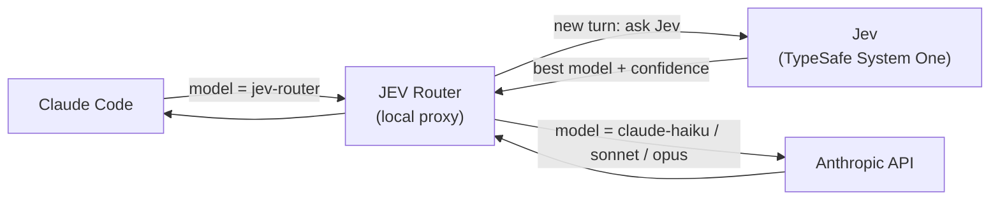
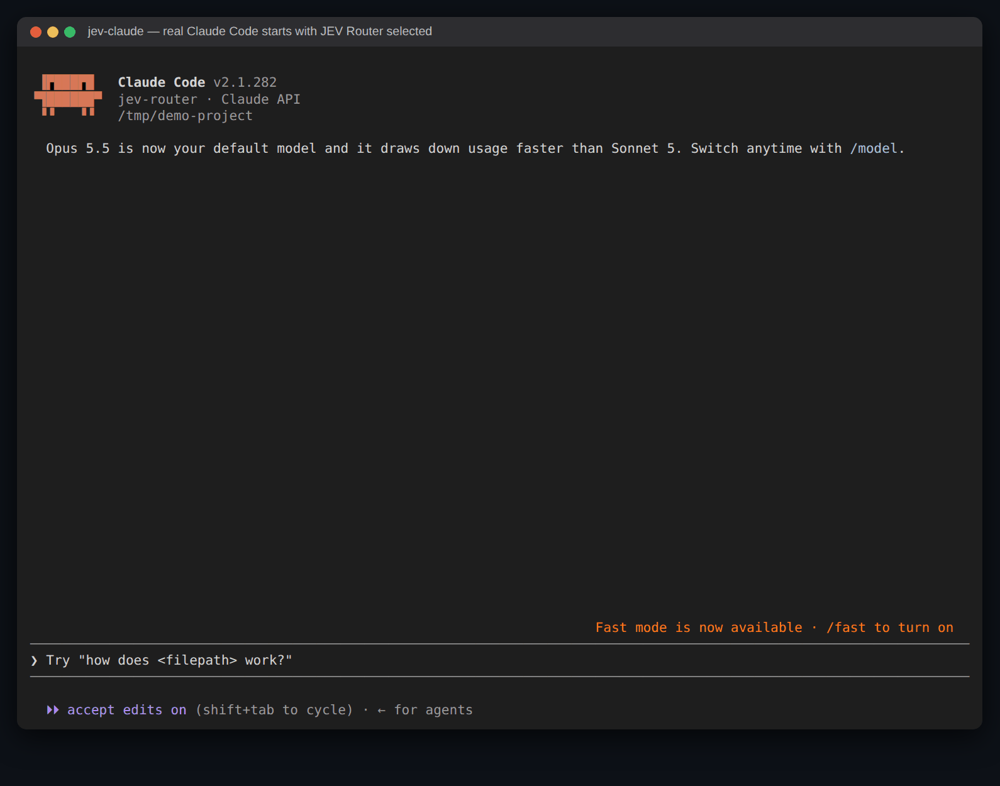
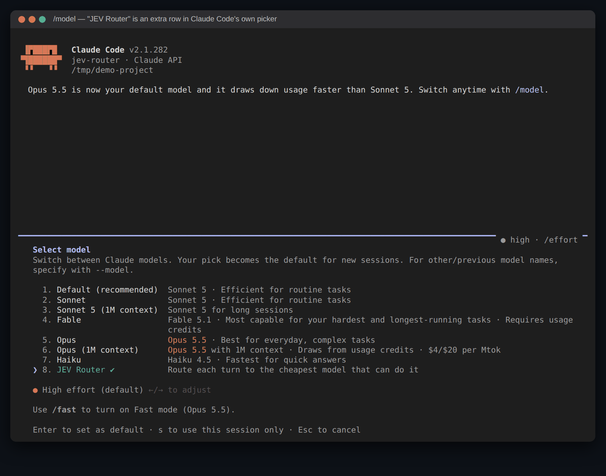
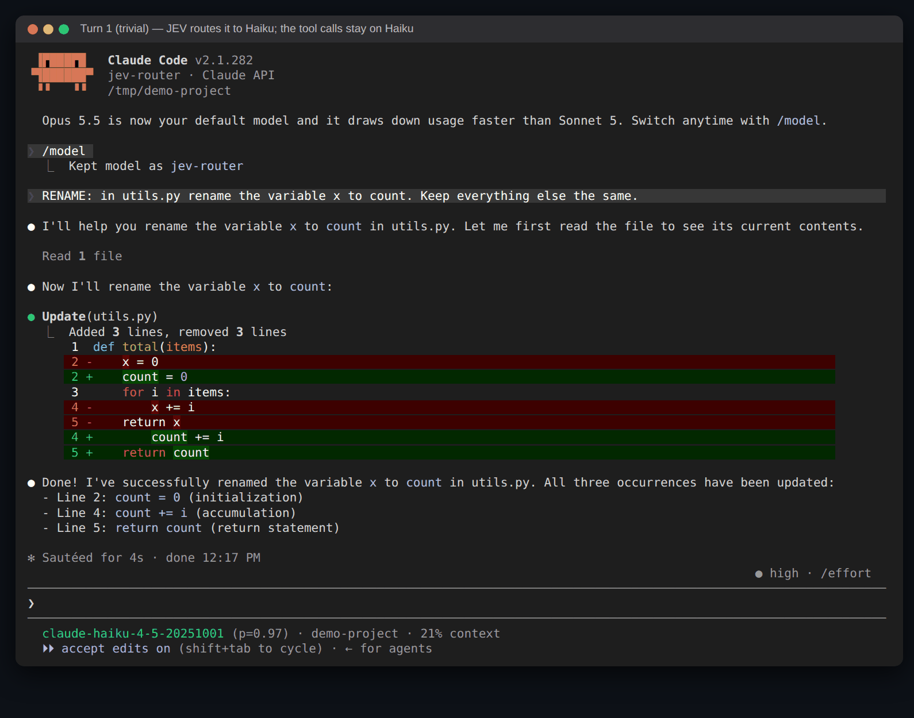
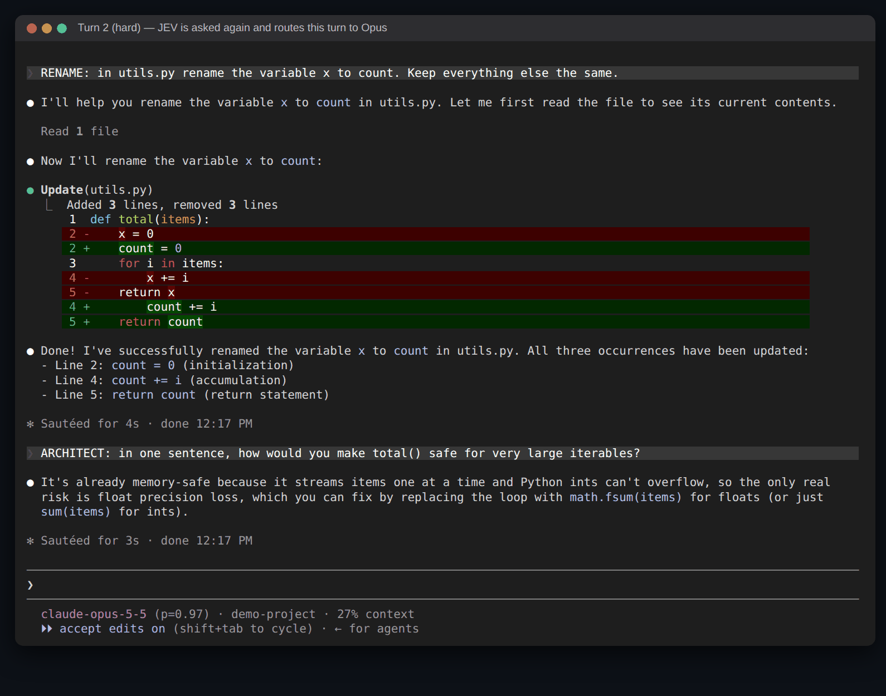
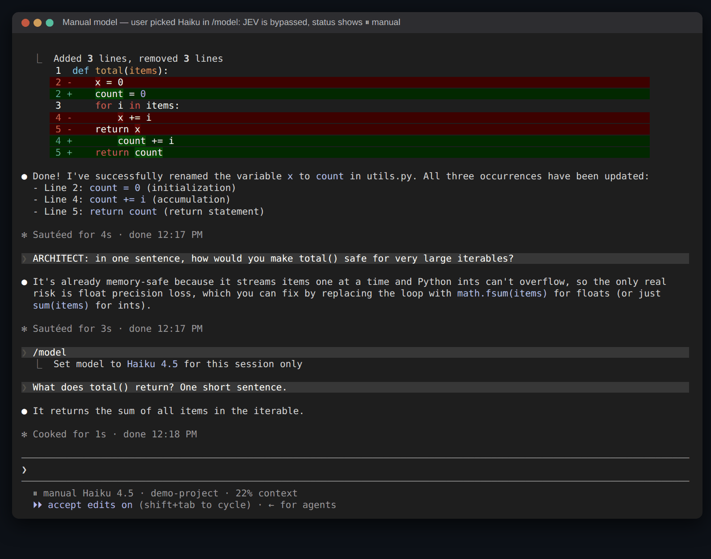
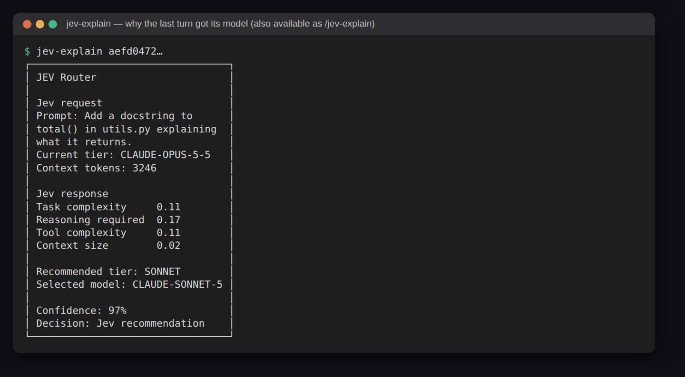
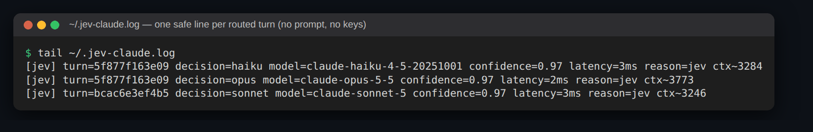

# JEV Model Router

> Per-turn model routing for Claude Code (and OpenAI Codex), decided by TypeSafe's Jev.

[]()
[]()
[]()

---

## What Is This?

A simple rename doesn't need the strongest model; a tricky concurrency bug does. JEV Model
Router picks the cheapest Claude model that can handle **each new turn** of your Claude Code
session, while Claude Code keeps working exactly as usual.



Jev is TypeSafe's [System One](https://docs.typesafe.ai/introduction/coding-agents) decision
model: it does not replace the LLM behind Claude Code. Claude stays the model that writes your
code; Jev only answers one fast structured question per turn — *which model should handle
this?* — with a confidence the router uses to decide whether to act on it.

---

## Quick Start

### 1. Install

```bash
git clone https://github.com/himanshu231204/jev_model_routers.git
cd jev_model_routers
pip install -e .
```

Requires Python ≥ 3.11, zero runtime dependencies, and [Claude Code](https://code.claude.com/docs/en/setup)
installed and logged in (subscription or API key — no extra Anthropic key is needed).

### 2. Set your Jev key

Get a key from the [TypeSafe dashboard](https://console.typesafe.ai/keys). It goes in
`TYPESAFE_API_KEY` — the name TypeSafe's docs and SDK use, and the only variable the router
reads (earlier versions used `JEV_API_KEY`; rename it if you have one):

```bash
echo "TYPESAFE_API_KEY=your_typesafe_key" > ~/.jev-router.env      # or export TYPESAFE_API_KEY=...
```

> 🔒 Never commit or share your key. It is read from the environment, `./.env`,
> `~/.jev-router.env` or `~/.jev-claude.env`, and is never logged.

### 3. Run

```bash
jev-claude                 # Claude Code, routing each new user turn
jev-claude -p "fix the failing test"   # every Claude Code argument is forwarded
jev-codex                  # OpenAI Codex, routing each new user turn
jev-explain <session-id>   # why the last turn got its model
```

`jev-claude` launches the real `claude` CLI with a local proxy in front of its API, so tools,
permissions, sessions (`/resume`), authentication and streaming are untouched — only the model
picked for each fresh turn changes. In Claude Code:

- **`/model` → "JEV Router"** (selected by default) routes each new turn: Jev is asked once per
  turn, picks from your account's own models (newest Haiku / Sonnet / Opus), and that model is
  pinned for the turn's whole tool loop.
- **`/model` → any real model** turns routing off; requests pass through untouched. Selecting
  "JEV Router" again turns it back on.
- **Jev unavailable** (no key, timeout, error): Claude Code keeps working on a safe fallback
  (Opus); nothing blocks.
- Each decision is logged as one safe line (model, confidence, latency, reason — no prompt) in
  `~/.jev-claude.log`; `JEV_DEBUG=1` adds request-level tracing.

For the full guide see [`docs/quickstart.md`](docs/quickstart.md); for the design see
[`ARCHITECTURE.md`](ARCHITECTURE.md).

---

## See It in Action

Screens from one real `jev-claude` session in Claude Code 2.1.282. In these captures Jev was
answered by the local stand-in [`scripts/fake_jev.py`](scripts/fake_jev.py) (the real Jev API
was not reachable from the capture environment); Claude Code, the proxy and the Anthropic
responses are real.

**1. Claude Code starts on JEV Router** — `jev-claude` launches the normal Claude Code UI.



**2. `/model` shows "JEV Router"** as an extra row in Claude Code's own picker.



**3. A trivial turn goes to Haiku** — Jev is asked once; the file read and edit stay on Haiku,
and the status line shows the routed model.



**4. A hard turn goes to Opus** — the next user turn asks Jev again and moves up.



**5. Picking a model yourself turns routing off** — the status line shows `⏸ manual` and
Jev is not called.



**6. `jev-explain` shows why** a turn got its model.



**7. The decision log** has one safe line per routed turn — no prompt, no keys.



---

## How It Works

| Principle | What it means |
|---|---|
| **One decision per turn** | Jev is asked once per new user turn; tool calls, retries and Claude Code's background requests reuse the pinned model |
| **Jev recommends, policy decides** | Low confidence never downgrades; a large conversation is not downgraded (prompt-cache rebuild); only models your account has are used |
| **Explicit choice wins** | A model picked in `/model`, or "use opus" in the prompt, overrides routing |
| **Fail open** | Any Jev failure falls back to a safe model within ~3 s; Claude Code never stops |
| **Nothing sensitive logged** | Keys, auth headers and prompts never reach the log |

The full design — sentinel model, fresh-turn detection, conversation pinning, model catalog,
streaming, failure handling — is in [`ARCHITECTURE.md`](ARCHITECTURE.md).

### Configuration

| Variable | Effect |
| --- | --- |
| `TYPESAFE_API_KEY` | TypeSafe key for Jev. Required for routing; without it `jev-claude` runs plain Claude Code. |
| `JEV_ALLOW_FABLE=1` | Also offer Fable (bills extra usage credits). |
| `JEV_NO_STATUSLINE=1` | Don't install the routing status line (your own status line is never overridden). |
| `JEV_DEBUG=1` | Request-level tracing, including the first 60 characters of each routed prompt. |
| `JEV_ENDPOINT` | Override the System One URL (testing). |
| `JEV_CLIENT=sdk` | Use the official TypeSafe SDK instead of stdlib HTTP (`pip install -e ".[typesafe]"`). |

Routing thresholds (confidence floor, cache-protection size, Jev timeouts) live in one place:
[`src/jev_router_live/config.py`](src/jev_router_live/config.py).

---

## Development

```bash
pip install -e ".[test]"
python -m pytest -q                         # all tests, Jev mocked

# real Jev API (opt-in): trivial / medium / hard prompts
JEV_LIVE_TESTS=1 TYPESAFE_API_KEY=... python -m pytest tests/live/test_live_jev_api.py -s
```

### Project Structure

```
src/jev_router_live/
├── config.py         # tiers, thresholds, override phrases, Jev questions
├── policy.py         # pure routing decision: Jev answer -> tier
├── router.py         # ask_jev dispatcher (stdlib client, or SDK with JEV_CLIENT=sdk)
├── stdlib_router.py  # Jev System One client: request, timeouts, retries, parsing
├── sdk_router.py     # optional client via the TypeSafe SDK
├── proxy.py          # Claude Code per-turn proxy
├── codex_proxy.py    # OpenAI Codex per-turn proxy
├── status.py         # per-session decision file (status line, jev-explain)
├── explain.py        # explanation report
├── settings.py       # restores Claude Code's saved default model on exit
├── log.py, env_file.py
├── bin/              # jev-claude, jev-codex, jev-statusline, jev-explain
└── skills/           # Codex $jev-explain skill, copied into ~/.agents/skills by jev-codex
tests/live/           # unit + proxy integration tests, opt-in real-Jev test
scripts/fake_jev.py   # local System One stand-in for end-to-end runs
```

---

## Contributing

See [`CONTRIBUTING.md`](CONTRIBUTING.md). Keep Claude Code's native behavior intact: the router
only rewrites the model (and fields that model cannot accept), and every failure must fall back
rather than block the user.

---

## License

[MIT](LICENSE)
