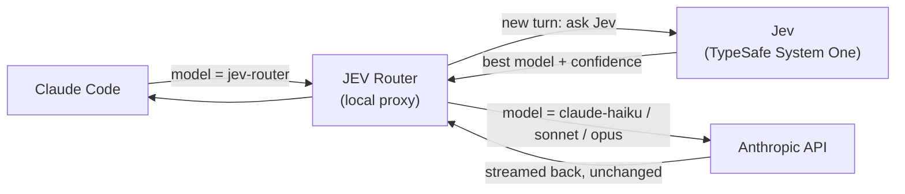

<p align="center">
  
</p>

<p align="center">
  <a href="https://github.com/himanshu231204/jev_model_routers/actions/workflows/ci.yml"></a>
  <a href="https://pypi.org/project/jev-model-router/"></a>
  <a href="https://github.com/himanshu231204/jev_model_routers/pkgs/container/jev_model_routers"></a>
  <a href="https://github.com/himanshu231204/jev_model_routers/blob/main/LICENSE"></a>
  
  
  
  
</p>

<p align="center">
  <a href="#-quick-start">Quick start</a> ·
  <a href="#-how-it-works">How it works</a> ·
  <a href="https://github.com/himanshu231204/jev_model_routers/blob/main/docs/quickstart.md">User guide</a> ·
  <a href="https://github.com/himanshu231204/jev_model_routers/blob/main/ARCHITECTURE.md">Architecture</a> ·
  <a href="https://github.com/himanshu231204/jev_model_routers/blob/main/CONTRIBUTING.md">Contributing</a>
</p>

---

**JEV Router** picks the Claude model for **each new turn** of your Claude Code session. Renaming
a variable doesn't need Opus; debugging a race condition does. JEV Router asks
[TypeSafe's Jev](https://docs.typesafe.ai/introduction/coding-agents) — a fast decision model —
which of your models fits the turn, then runs it there. Claude Code keeps working exactly as
usual: same UI, tools, permissions, sessions and streaming.

```bash
pip install jev-model-router
jev-claude          # that's it — Claude Code, with per-turn routing
```

## ✨ Features

- **Per-turn routing** — every new message is judged on its own, so a session can move from
  Haiku to Opus and back as the work changes.
- **Native Claude Code** — a local proxy in front of Claude Code's API; nothing to configure in
  Claude Code, no fork, no plugin. `/resume`, permissions, tools and streaming are untouched.
- **You stay in control** — pick a model in `/model` and routing steps aside; pick
  **JEV Router** again to resume. Say "use opus" in a prompt to force it for one turn.
- **Tool loops stay on one model** — Jev is asked once per turn; every file read, edit and
  command in that turn reuses the chosen model.
- **Fails open** — no key, a Jev timeout or an error never blocks you; Claude Code carries on
  with a safe model within ~3 seconds.
- **Explainable** — a status-line readout of every decision, `jev-explain` for the full
  reasoning, and a one-line log per turn.
- **Private by design** — your key and prompts are never logged; local files are owner-only.
- **Zero dependencies** — pure Python standard library.

## 🎬 Demo

<p align="center">
  
  
</p>
<p align="center"><sub><b>Left:</b> "JEV Router" in Claude Code's own <code>/model</code> picker. <b>Right:</b> a rename routed to Haiku — the status line shows the model Jev picked.</sub></p>

<details>
<summary><b>More screenshots</b> — hard turn on Opus, manual override, <code>jev-explain</code>, decision log</summary>
<br>

**A harder turn moves up to Opus** — Jev is asked again on the next message:


**Picking a model yourself pauses routing** — the status line shows `⏸ manual`:


**`jev-explain` shows why** a turn got its model:


**One safe log line per turn** — no prompt, no keys:


<sub>Captured from a real Claude Code 2.1.282 session through <code>jev-claude</code>; Jev's answers came from the local stand-in <a href="https://github.com/himanshu231204/jev_model_routers/blob/main/scripts/fake_jev.py"><code>scripts/fake_jev.py</code></a>.</sub>
</details>

## 🚀 Quick start

**Requirements:** Python 3.11+, [Claude Code](https://code.claude.com/docs/en/setup) installed and
logged in (a claude.ai subscription or an API key — no extra Anthropic key needed), and a
[TypeSafe API key](https://console.typesafe.ai/keys).

**1. Install**

```bash
pip install jev-model-router
```

<sub>Latest development version: <code>pip install git+https://github.com/himanshu231204/jev_model_routers</code></sub>

**2. Add your TypeSafe key** — `TYPESAFE_API_KEY`, the name TypeSafe's docs and SDK use:

```bash
echo "TYPESAFE_API_KEY=your_key" > ~/.jev-router.env        # or: export TYPESAFE_API_KEY=...
```

<sub>Windows PowerShell: <code>Set-Content "$HOME\.jev-router.env" "TYPESAFE_API_KEY=your_key"</code></sub>

**3. Run**

```bash
jev-claude                          # interactive, routing each new turn
jev-claude -p "fix the failing test"   # every Claude Code argument is passed through
jev-claude --resume                 # sessions work as usual
```

The session starts on **JEV Router**. Watch the status line — e.g.
`claude-haiku-4-5-20251001 (p=0.97)` — to see which model each turn got. The full guide, with
troubleshooting, is in [`docs/quickstart.md`](https://github.com/himanshu231204/jev_model_routers/blob/main/docs/quickstart.md).

<details>
<summary><b>Or run it with Docker</b> — no local Python/Node setup</summary>

The image bundles `jev-claude`, `jev-codex` and the CLIs they wrap. Mount your Claude Code
login (`~/.claude`) and your project directory, and pass the key as an environment variable:

```bash
docker run -it --rm \
  -e TYPESAFE_API_KEY=your_key \
  -v ~/.claude:/home/jev/.claude \
  -v "$PWD":/work \
  ghcr.io/himanshu231204/jev_model_routers        # entrypoint is jev-claude
```

Pass Claude Code arguments after the image name (they go straight to the entrypoint), e.g.
`... jev_model_routers -p "fix the failing test"`. For `jev-codex`, override the entrypoint
(`--entrypoint jev-codex`) and mount `~/.codex` instead. Images are built from source and
published on tagged releases; see
[`Dockerfile`](https://github.com/himanshu231204/jev_model_routers/blob/main/Dockerfile) and
[`RELEASE.md`](https://github.com/himanshu231204/jev_model_routers/blob/main/RELEASE.md).
</details>

## 🧠 How it works



1. `jev-claude` starts Claude Code with a local proxy as its API endpoint and a **JEV Router**
   entry in `/model`.
2. When you send a message, the proxy asks Jev which of your account's models — newest Haiku,
   Sonnet or Opus — can handle it, with a confidence score.
3. A small local **policy** makes the final call: explicit choices win, low confidence never
   downgrades, and a long conversation isn't downgraded (switching would re-read it all).
4. Only the request's model is rewritten; Claude's response streams straight back.
5. Tool calls, retries and Claude Code's background requests in the same turn reuse that model.

Jev doesn't write code — Claude does. Jev answers one quick structured question per turn, the
kind of *"route this to one of a fixed set of destinations, and know how confident you are"*
decision it is built for. Design details: [`ARCHITECTURE.md`](https://github.com/himanshu231204/jev_model_routers/blob/main/ARCHITECTURE.md).

## ⚙️ Configuration

Everything works with just the key. Optional environment variables:

| Variable | Effect |
| --- | --- |
| `TYPESAFE_API_KEY` | TypeSafe key for Jev. Required for routing; without it `jev-claude` runs plain Claude Code. |
| `JEV_ALLOW_FABLE=1` | Also offer Fable (bills extra usage credits). |
| `JEV_NO_STATUSLINE=1` | Don't add the routing status line (your own status line is never overridden). |
| `JEV_DEBUG=1` | Request-level tracing in `~/.jev-claude.log`, including prompt excerpts. |
| `JEV_CLIENT=sdk` | Call Jev through the official `typesafe-sdk` (`pip install "jev-model-router[typesafe]"`). |

Routing thresholds (confidence floor, cache protection, timeouts) live in one file:
[`src/jev_router_live/config.py`](https://github.com/himanshu231204/jev_model_routers/blob/main/src/jev_router_live/config.py).

## 🧰 Commands

| Command | What it does |
| --- | --- |
| `jev-claude [claude args…]` | Run Claude Code with per-turn routing. |
| `jev-codex [codex args…]` | Run OpenAI Codex with per-turn routing *(experimental)*. |
| `jev-explain <session-id>` | Show why the last turn got its model. |

## ❓ FAQ

<details>
<summary><b>Does it replace Claude?</b></summary>

No. Claude still does all the work. Jev only chooses which Claude model handles each turn.
</details>

<details>
<summary><b>What happens if Jev is down or my key is wrong?</b></summary>

Routing fails open: the turn runs on a safe model (Opus on the first turn, otherwise the model
already in use) within about three seconds, and the reason is logged. Claude Code never stops.
</details>

<details>
<summary><b>What does Jev see?</b></summary>

The prompt of each new turn (with Claude Code's injected system context removed), the current
model, a rough context size, and the list of models to choose from. Not your files, tool output
or conversation history.
</details>

<details>
<summary><b>Will it change my Claude Code settings?</b></summary>

No. "JEV Router" is selected for the session only and never saved as your default; if Claude
Code persists it anyway, `jev-claude` restores your previous default on exit. Plain `claude` is
unaffected.
</details>

<details>
<summary><b>Claude Code prints <code>[claude-code:unrecognized_model] {"model":"jev-router"}</code> at startup.</b></summary>

Harmless — it's Claude Code noting the extra "JEV Router" entry. Requests are still routed.
</details>

## 📍 Project status

**Beta.** Verified end to end against Claude Code 2.1.282 (interactive and `-p`): the picker entry,
per-turn routing, tool-loop pinning, manual override, fail-open and streaming, with 105 automated
tests on Python 3.11 and 3.12. OpenAI Codex support (`jev-codex`) is experimental. Known
limitations are listed in [`ARCHITECTURE.md`](https://github.com/himanshu231204/jev_model_routers/blob/main/ARCHITECTURE.md#15-known-limitations).

## 🤝 Contributing

Contributions are welcome — see [`CONTRIBUTING.md`](https://github.com/himanshu231204/jev_model_routers/blob/main/CONTRIBUTING.md) for setup and conventions and
[`AGENTS.md`](https://github.com/himanshu231204/jev_model_routers/blob/main/AGENTS.md) for the invariants a change must keep. Please report security issues
privately as described in [`SECURITY.md`](https://github.com/himanshu231204/jev_model_routers/blob/main/SECURITY.md).

```bash
git clone https://github.com/himanshu231204/jev_model_routers.git && cd jev_model_routers
pip install -e ".[test]"
python -m pytest -q
```

## 📄 License

[MIT](https://github.com/himanshu231204/jev_model_routers/blob/main/LICENSE) © 2026 Himanshu Kumar

<sub>JEV Router is an independent open-source project and is not affiliated with Anthropic or TypeSafe. Claude and Claude Code are products of Anthropic; Jev is a model by TypeSafe.</sub>
