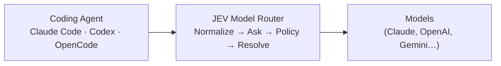
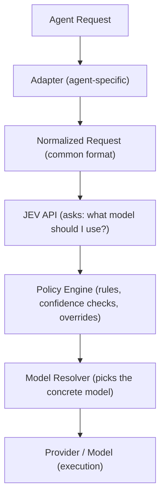

# JEV Model Router

> An agent-agnostic intelligent model routing layer for AI coding agents.

[]()
[]()
[]()

---

## What Is This?

JEV Model Router sits between your coding agent (Claude Code, Codex, OpenCode, and others) and the AI models they use.

Instead of forcing every coding task onto a single model, it uses the **JEV API** to pick the best available model for each task — automatically.



**Why?** A simple README edit doesn't need the strongest model. A complex architectural refactor does. JEV makes that decision per turn, so you always get the right model without changing how you work.

---

## Quick Start

### 1. Install

```bash
pip install -e .
```

Or install from PyPI when available:

```bash
pip install jev-router
```

### 2. Set Your JEV API Key

`jev/client.py` calls TypeSafe's Jev decision model via TypeSafe's System One API
(`https://api.typesafe.ai/v1/systemone`), so `TYPESAFE_API_KEY` should be a
[TypeSafe](https://typesafe.ai/) API key.

```bash
# Linux / macOS
export TYPESAFE_API_KEY="your_typesafe_api_key"

# Windows PowerShell
$env:TYPESAFE_API_KEY="your_typesafe_api_key"
```

> 🔒 Never commit or share your API key. Use `.env`, OS secret managers, or CI/CD secret stores.

### 3. Run

```bash
jev-router run --agent claude_code --prompt "add input validation to the login form"
```

This makes one JEV routing decision for the session — using `--prompt` as the signal — then
launches `claude` with that model applied. `--agent` defaults to `claude_code`; run
`jev-router agents` to see every registered adapter and whether it's detected on your machine.
Omitting `--prompt` gives JEV nothing to route on, so it typically falls back to the current/
default model instead of picking one.

For the full integration guide, see [`docs/quickstart.md`](docs/quickstart.md).

---

## How It Works

Every coding request goes through a simple pipeline:



### Key Principles

| Principle | What it means |
|---|---|
| **Agent-agnostic** | Works with Claude Code, Codex, OpenCode, DeepAgents, Hermes — and any future agent via adapters |
| **One decision per turn** | Routes once per user turn; the rest of the tool loop reuses the selected model |
| **Explicit overrides win** | If a user manually picks a model, that choice always wins |
| **Fail open** | If JEV is unavailable, the router falls back to the current/default model — coding never stops |
| **No secrets in logs** | API keys, prompts, and auth headers are never logged |

---

## Installation

### Prerequisites

- **Python ≥ 3.11**
- **A [TypeSafe](https://typesafe.ai/) API key** (used as `TYPESAFE_API_KEY` to reach TypeSafe's Jev model)

### From Source

```bash
git clone https://github.com/himanshu231204/jev_model_routers.git
cd jev_model_routers
pip install -e .
```

### Verify

```bash
jev-router --help
```

---

## Configuration

Config is managed via YAML files. The default config is at `configs/default.yaml`:

```yaml
router:
  enabled: true
  policy: default
  fail_mode: open       # routing failure → continue with current model

jev:
  timeout_ms: 1500      # keep calls short — routing is on the hot path
  deadline_ms: 3000
  max_retries: 1

models:
  allow:
    - anthropic/claude-fable   # fast tier
    - anthropic/claude-haiku   # fast tier (alternate)
    - anthropic/claude-sonnet  # balanced tier
    - anthropic/claude-opus    # strong tier
    - openai/coding-strong     # strong tier (codex/opencode/hermes only)

agents:
  auto_detect: true
```

Config precedence: **CLI args → environment variables → project config → user config → defaults**.

---

## Adapters

Each coding agent gets its own adapter — the core router never changes.

| Agent | Status |
|---|---|
| Claude Code | 🟢 Implemented |
| OpenAI Codex | 🟢 Implemented |
| OpenCode | 🟢 Implemented |
| DeepAgents | 🟢 Implemented |
| Hermes | 🟢 Implemented |

Adding a new adapter requires only:
1. Create the adapter module
2. Normalize the native request
3. Implement model application
4. Add tests

No changes to the core router, policy, JEV auth, or state layer needed.

---

## Command Line

```bash
jev-router run --agent <name>  # Route once at session start, launch the agent (default: claude_code)
jev-router agents              # List registered adapters and detection status
jev-router models              # Show the configured model catalog
jev-router status              # Show current routing state (enabled/passthrough)
jev-router explain             # Explain the last routing decision
jev-router doctor              # Diagnose environment/config (Python version, key presence)
```

Passthrough (no routing) happens automatically whenever `TYPESAFE_API_KEY` is unset — there's
no separate flag for it.

---

## Development

```bash
# Install in development mode, with pytest
pip install -e ".[test]"

# Run all tests
python -m pytest

# Run tests for a specific module
python -m pytest tests/unit/test_policy.py
```

### Project Structure

```
src/jev_router/
├── cli/          # Command-line interface
├── core/         # Router, policy, resolver
├── contracts/    # NormalizedRequest, ModelSpec types
├── adapters/     # Agent-specific adapters
├── providers/    # Provider integrations
├── jev/          # JEV API client
├── transport/    # HTTP/SSE/WS forwarding
├── state/        # Per-turn/session persistence
├── config/       # Runtime configuration
├── security/     # Secrets/redaction
└── observability/# Logs, metrics, explanations
```

---

## Contributing

Contributions should preserve the core architecture:

> **Agents adapt to the router. The router should not become agent-specific.**

When adding a new integration, prefer a new adapter over adding agent-specific branches to the routing core. See `ARCHITECTURE.md` for the full design.

---

## License

[MIT](LICENSE)
