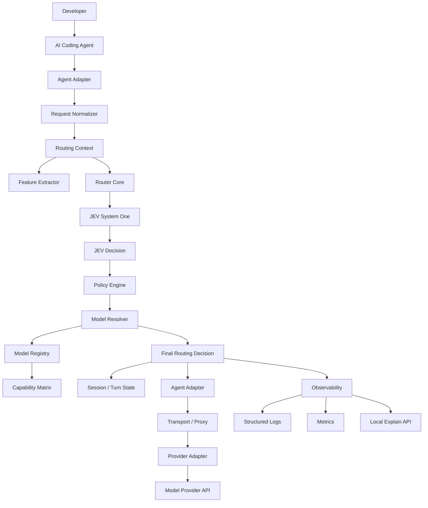
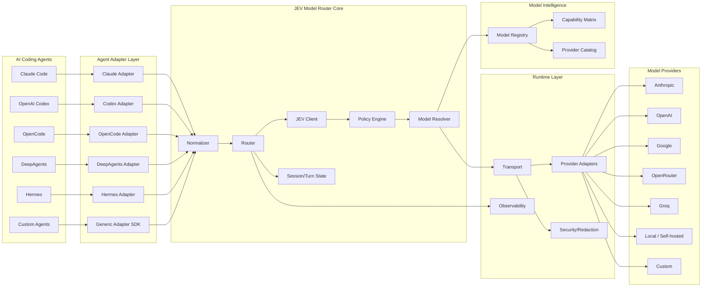

# System Architecture

> Source: `ARCHITECTURE.md` (§5, §101, §102) — verbatim split, do not edit here; propose changes against the source section.

> Back to index: [docs/README.md](./README.md)

---

# 5. High-Level System Architecture



---

---

# 101. Final Reference Architecture



---

---

# 102. The Core Abstraction in One Picture

The entire project can be reduced to this contract:

```text
┌──────────────────────────────────────────────────────────┐
│                    AGENT REQUEST                         │
│                                                          │
│ Claude / Codex / OpenCode / DeepAgents / Hermes / Custom │
└───────────────────────────┬──────────────────────────────┘
                            │
                            ▼
┌──────────────────────────────────────────────────────────┐
│                  NORMALIZED REQUEST                      │
│                                                          │
│ prompt + context + tools + current model + candidates   │
└───────────────────────────┬──────────────────────────────┘
                            │
                            ▼
┌──────────────────────────────────────────────────────────┐
│                         JEV                              │
│                                                          │
│ What level/capability is required for this task?         │
└───────────────────────────┬──────────────────────────────┘
                            │
                            ▼
┌──────────────────────────────────────────────────────────┐
│                    POLICY ENGINE                         │
│                                                          │
│ Can we safely apply this decision?                       │
└───────────────────────────┬──────────────────────────────┘
                            │
                            ▼
┌──────────────────────────────────────────────────────────┐
│                    MODEL RESOLVER                        │
│                                                          │
│ Which concrete available model satisfies the request?    │
└───────────────────────────┬──────────────────────────────┘
                            │
                            ▼
┌──────────────────────────────────────────────────────────┐
│                  TURN STATE / PIN                        │
│                                                          │
│ Keep the selected model stable through the tool loop.    │
└───────────────────────────┬──────────────────────────────┘
                            │
                            ▼
┌──────────────────────────────────────────────────────────┐
│                    AGENT ADAPTER                         │
│                                                          │
│ Convert decision back into the agent's native protocol.  │
└───────────────────────────┬──────────────────────────────┘
                            │
                            ▼
┌──────────────────────────────────────────────────────────┐
│                  MODEL PROVIDER                          │
└──────────────────────────────────────────────────────────┘
```

---
