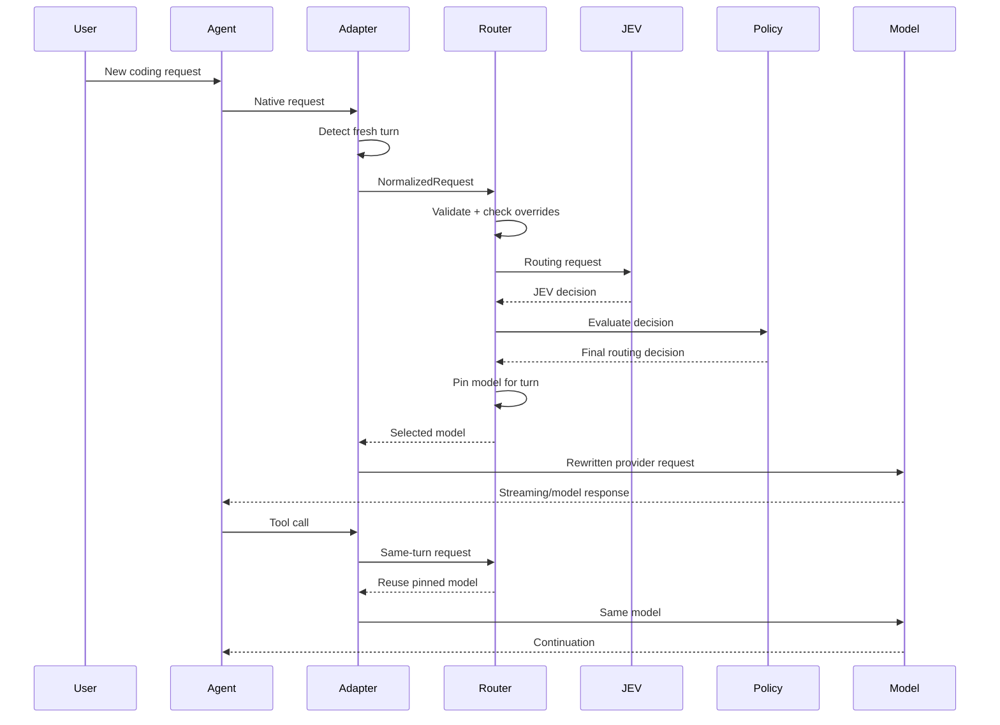

# Turn State and Concurrency

> Source: `ARCHITECTURE.md` (§23, §24, §25, §41, §42, §43, §44, §45, §81, §82) — verbatim split, do not edit here; propose changes against the source section.

> Back to index: [docs/README.md](./README.md)

---

# 23. Turn Pinning

The model selected for a turn should remain fixed through its tool loop.

State:

```python
@dataclass
class TurnState:
    turn_id: str
    model: str
    tier: str
    created_at: float
    reason: str
    confidence: float | None
```

Flow:

```text
new user turn
      ↓
route once
      ↓
pin selected model
      ↓
tool call #1 → same model
      ↓
tool call #2 → same model
      ↓
tool result → same model
      ↓
turn complete
      ↓
unpin
```

---

---

# 24. Conversation / Sub-Agent Isolation

A coding agent may run sub-agents.

Do not let a sub-agent's routing state overwrite the main agent's state.

Use:

```text
state key =
agent + session_id + conversation_id + subagent_id
```

Example:

```text
main-session-123
main-session-123/subagent-1
main-session-123/subagent-2
```

Each can have independent routing state.

---

---

# 25. Context-Aware Routing

Context size is an important routing feature.

A model switch can force a large prompt/context to be resent or rebuild provider-side caches depending on the upstream stack.

Therefore:

```text
small context + simple task
    → downgrade is cheap

large context + simple task
    → downgrade may not be worth it

large context + difficult task
    → strong model may be justified
```

The policy engine should therefore evaluate:

```python
context_pressure = context_tokens / max_context_tokens
```

and use it as a routing constraint rather than blindly following tier changes.

---

---

# 41. Session State Store

The router needs ephemeral state.

Default implementation:

```text
in-memory Map
```

Optional persistence:

```text
SQLite
```

Do not introduce Redis/PostgreSQL in the first version unless there is a real multi-process requirement.

State should include:

```python
@dataclass
class SessionState:
    session_id: str
    conversation_id: str
    active_turn_id: str | None
    pinned_model: str | None
    pinned_tier: str | None
    baseline_model: str | None
    manual_override: bool
    last_decision_id: str | None
    created_at: float
    updated_at: float
```

---

---

# 42. Turn Lifecycle



---

---

# 43. Request Classification

The router should distinguish:

```text
fresh user turn
assistant continuation
model metadata request
health check
model list request
auxiliary request
sub-agent request
tool continuation
```

Only appropriate request types should invoke JEV.

For example:

```text
GET /models
```

should not cause a routing decision.

Likewise:

```text
tool_result continuation
```

should not invoke JEV again.

---

---

# 44. Auxiliary Calls

Coding agents often make internal calls for:

- summaries
- titles
- metadata
- context compression
- background classification

These should not automatically alter the user's active routing state.

Use:

```python
RequestKind.AUXILIARY
```

and normally bypass turn routing.

---

---

# 45. Sub-Agent Routing

Optional configuration:

```yaml
subagents:
  inherit_parent_model: true
  allow_independent_routing: true
  max_tier: strong
```

Recommended default:

```text
main agent
    ↓
model pinned

sub-agent
    ↓
independent routing allowed
    OR
inherit parent model
```

This should be configurable because different workflows need different behavior.

---

---

# 81. Concurrency

Multiple sessions must route independently.

```text
Session A → decision A
Session B → decision B
Session C → decision C
```

The state store must be concurrency-safe.

Avoid one global:

```python
current_model
```

because that creates cross-session contamination.

---

---

# 82. Multi-Agent Worktree Isolation

For coding agents operating in different repositories/worktrees, use repository/session identity as part of routing state.

```text
(agent, session, conversation, worktree)
```

Do not assume one process equals one coding session.

---
