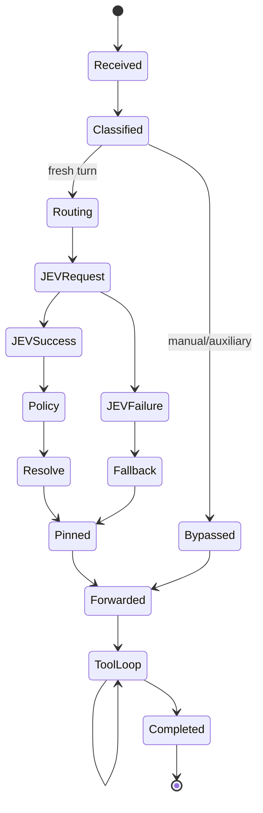

# Observability and Explainability

> Source: `ARCHITECTURE.md` (§50, §51, §52, §74, §75, §76) — verbatim split, do not edit here; propose changes against the source section.

> Back to index: [docs/README.md](./README.md)

---

# 50. Observability Architecture

Every routing decision should produce a structured event.

```json
{
  "event": "routing.decision",
  "request_id": "req_123",
  "agent": "claude-code",
  "session_id": "sess_123",
  "turn_id": "turn_4",
  "current_model": "balanced",
  "selected_model": "strong",
  "confidence": 0.93,
  "reason": "high_reasoning",
  "jev_latency_ms": 412,
  "policy_version": "1",
  "fallback": false
}
```

---

---

# 51. Privacy-Safe Logging

Default logs:

```text
request_id
agent
model
routing result
latency
reason
confidence
```

Do not log full prompts by default.

Debug mode may optionally store redacted routing payloads:

```bash
JEV_ROUTER_DEBUG=1
```

and should explicitly warn that prompts may be present.

---

---

# 52. Explain Command

Recommended UX:

```bash
jev-router explain
```

Possible output:

```text
JEV Model Router
────────────────────────────────
Agent:           Claude Code
Turn:            17
Current model:   Sonnet

Task complexity      0.84
Reasoning required   0.91
Tool complexity      0.67
Context pressure     0.34

JEV recommendation   Opus
Confidence            0.94

Policy                quality-upgrade
Final model           Opus

Reason:
High reasoning requirement and cross-file
changes justified a stronger model.
```

---

---

# 74. Explanation API

The router should expose a local explanation endpoint or IPC interface.

Example:

```text
GET /v1/status
GET /v1/decisions/latest
GET /v1/decisions/:id
```

Example response:

```json
{
  "id": "decision_123",
  "agent": "codex",
  "current_model": "balanced",
  "selected_model": "strong",
  "confidence": 0.91,
  "reason": "high reasoning requirement",
  "metrics": {
    "task_complexity": 0.83,
    "reasoning_required": 0.90,
    "tool_complexity": 0.73,
    "context_pressure": 0.24
  }
}
```

---

---

# 75. Telemetry Metrics

Recommended metrics:

```text
jev_router_requests_total
jev_router_routing_decisions_total
jev_router_fallback_total
jev_router_jev_errors_total
jev_router_jev_latency_ms
jev_router_model_switches_total
jev_router_downgrades_total
jev_router_upgrades_total
jev_router_adapter_errors_total
jev_router_provider_errors_total
```

Useful dimensions:

```text
agent
provider
model
policy
result
fallback_reason
```

Avoid high-cardinality prompt-based labels.

---

---

# 76. Decision Event Lifecycle



---
