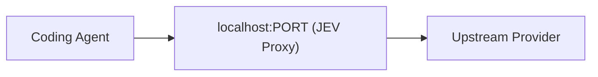
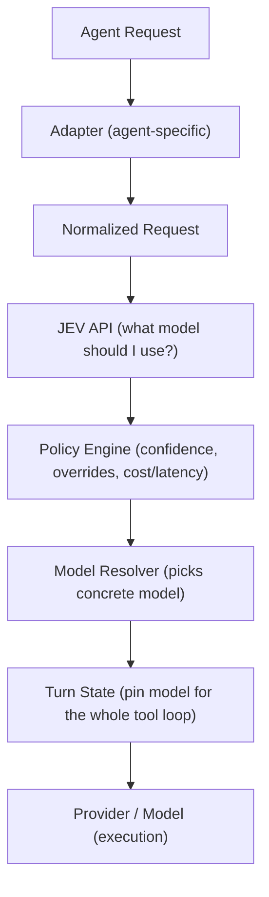

# Quick Start — Integration Guide

> How to integrate JEV Model Router into your coding agent.

---

## What This Covers

This guide shows how to route your coding agent's model requests through JEV Model Router automatically. Three integration strategies are supported:

1. **CLI Wrapper** — wrap an existing agent command
2. **Reverse Proxy** — point agent's provider endpoint at JEV
3. **SDK Adapter** — embed the router into Python/TypeScript code

---

## Prerequisites

- **Python ≥ 3.11**
- **A [TypeSafe](https://typesafe.ai/) API key** — `jev/client.py` calls TypeSafe's Jev
  decision model via TypeSafe's System One API (`POST https://api.typesafe.ai/v1/systemone`),
  so `TYPESAFE_API_KEY` holds a TypeSafe key.

```bash
# Linux / macOS
export TYPESAFE_API_KEY="your_typesafe_api_key"

# Windows PowerShell
$env:TYPESAFE_API_KEY="your_typesafe_api_key"
```

---

## Install

```bash
pip install -e .
# or
pip install jev-router
```

Verify:

```bash
jev-router --help
```

---

## Integration Strategies

### 1. CLI Wrapper

The simplest approach. Launch your agent through `jev-router run --agent <name> --prompt
"<task>"`:

```bash
jev-router run --agent claude_code --prompt "add input validation to the login form"
jev-router run --agent codex --prompt "write a script to migrate the database schema"
jev-router run --agent hermes --prompt "fix the failing CI job"
```

`--agent` defaults to `claude_code`. `--prompt`/`-p` is the task description JEV routes on —
**omit it and JEV has no signal to route with**: live-verified, an empty prompt reliably
returns confidence around 0.27 (below the policy's `low` threshold of 0.30), so the router
falls back to the current/default model (`reason=low_confidence_keep_current`) instead of
picking one. The same real prompt live-verified confidence 0.97 for the same tier. Run
`jev-router agents` to see the full list of registered adapter names.

`jev-router run` makes **one JEV routing decision at session start**, then launches the real
agent binary via `subprocess.run` with that model applied (`claude --model <m>`,
`codex --model <m>`, or `hermes chat --model <m>`), inheriting stdio for a normal interactive
session. This is *not* per-turn routing — there is no live proxy intercepting requests
mid-session yet (see "Reverse Proxy" below), so the model picked at launch stays fixed for the
whole session.

Two adapters raise a clear error instead of launching, rather than faking a working command:
- `opencode` — its interactive CLI (`opencode [directory]`) has no top-level `--model` flag;
  `--model` only exists under `opencode run`, a one-shot non-interactive mode.
- `deepagents` — has no standalone CLI binary at all; it's embedded via
  `adapters/deepagents/adapter.py`/`middleware.py` instead.

Additional commands:

```bash
jev-router agents     # List detected agents
jev-router models     # Show available models
jev-router status     # Show current routing state
jev-router explain    # Explain the last routing decision
jev-router doctor     # Diagnose configuration and adapter compatibility
```

### 2. Reverse Proxy

> **Not yet implemented.** `src/jev_router/transport/` has `HttpTransport`, `SseTransport`,
> and `WebsocketTransport`, but there is no `--proxy` CLI flag or standalone proxy server yet.
> The strategy below describes the target design from `ARCHITECTURE.md`, not current behavior.

Set your agent's `base_url` to the JEV local proxy:



The router intercepts model requests, rewrites the model identifier, and forwards to the original provider. Works with any agent that supports configurable `base_url`/provider endpoint.

Start the proxy:

```bash
jev-router --proxy
```

Then configure your agent to use `http://localhost:PORT` as its provider endpoint.

### 3. SDK Adapter

> **Not yet implemented.** There is no `JEVRouter` or `JEVRoutedModel` class in
> `src/jev_router/` today — DeepAgents integration currently goes through
> `adapters/deepagents/adapter.py` and `middleware.py` like the other adapters. The example
> below describes the target design from `ARCHITECTURE.md`, not current behavior.

For agents embedded as Python/TypeScript libraries (DeepAgents, custom agents):

```python
from jev_router import JEVRouter

router = JEVRouter()

# Use JEVRoutedModel to intercept model selection
agent = create_agent(
    model=JEVRoutedModel(candidates=["claude-sonnet", "claude-opus"])
)
```

The adapter intercepts the model invocation boundary:
- One logical user turn → one JEV decision
- All tool iterations reuse the pinned model
- Sub-agents route independently or inherit the parent model

---

## How It Works



**Key invariants:**

- **One decision per fresh turn** — pinned through the entire tool loop
- **Explicit user choice always wins** — manual override beats automatic routing
- **Fail open** — if JEV is unavailable, falls back to current/default model
- **No secrets in logs** — API keys and prompts are never logged

---

## Configuration

Config precedence: **CLI args → env vars → project config → user config → defaults**.

Example `config.yaml`:

```yaml
router:
  enabled: true
  policy: default
  fail_mode: open

jev:
  timeout_ms: 1500
  deadline_ms: 3000
  max_retries: 1

agents:
  auto_detect: true
```

For full configuration options, see `ARCHITECTURE.md` §10 (Configuration).

---

## Troubleshooting

| Problem | Solution |
|---|---|
| JEV unavailable | Router falls back to current model automatically |
| Agent not detected | Run `jev-router doctor` to diagnose |
| `opencode`/`deepagents` won't launch | Expected — their `launch_command` raises `NotImplementedError`; see "CLI Wrapper" above |
| The launched agent rejects `--model <id>` as unknown | Known gap — `configs/default.yaml`'s default `models.allow` catalog ships placeholder-style ids (e.g. `anthropic/claude-sonnet`) that aren't real model names any agent's `--model` flag or the Anthropic/OpenAI APIs recognize. Edit `models.allow` to real model ids for your agent until a per-agent translation layer exists. |
| Wrong model routed | Check `jev-router status`/`explain`; there's no manual override flag on `run` yet, only the adapters' own `--model` once launched |

Run `jev-router doctor` for environment diagnostics.

---

## Adding a New Agent

To add support for a new coding agent:

1. Create `src/jev_router/adapters/<name>/adapter.py`
2. Implement normalization, turn detection, and model application
3. Register in `src/jev_router/adapters/registry.py`
4. Add fixtures and tests

No changes to core router, policy, or JEV auth are needed. See `ARCHITECTURE.md` §8
(Architectural Rules) and `AGENTS.md`'s "Common workflows" section for the full checklist.
